|  MAQUINA   |  OS   | DIFICULTAD |  PLATAFORMA  |       IP       |
| :--------: | :---: | :--------: | :----------: | :------------: |
| LinkVortex | Linux |   Facil    | Hack the box | linkvortex.HTB |
## *Reconocimiento*

Comenzamos con nuestro escaneo hacia la IP de la maquina, hay que tener en cuenta que para todas las maquinas de HTB vamos a tener que ingresar la IP a nuestro `/etc/hosts`. Al escanear la dirección IP tenemos 2 puertos, **22/TCP SSH** **80/TCP HTTP**

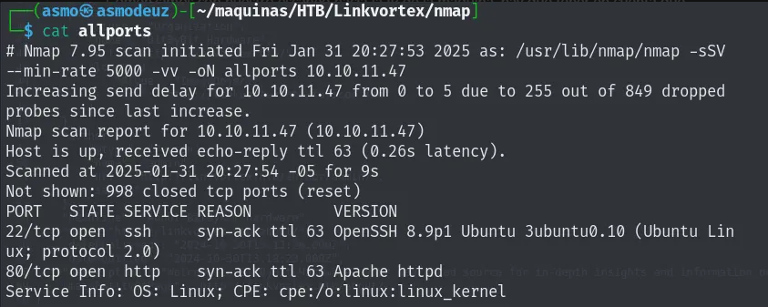

Ya en la pagina Linkvortex.htb tenemos el siguiente diseño, bien seria investigar un poco por nuestro lado para saber si hay pistas en el código fuente de la pagina.


Con la herramienta Dirseach, Gobuster,Ffuf, Dirb podemos hacer un scan para encontrar directorios los cuales podrían darnos acceso a lugares que pudieron no haber ocultado o denegado el acceso.

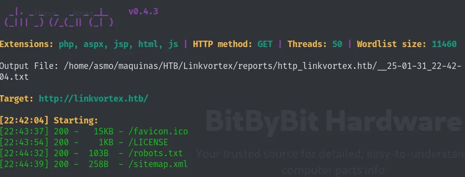

En el caso tenemos el archivo más conocido que es `robots.txt` , mientas investigaba las rutas no vi nada interesante. Opté por buscar información por el lado de los subdominios y encuentro una dirección, lo añado al `/etc/hosts`.

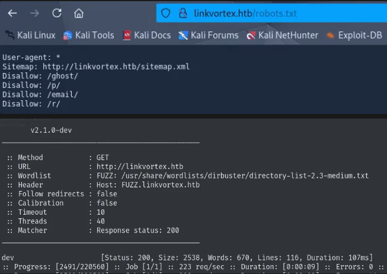
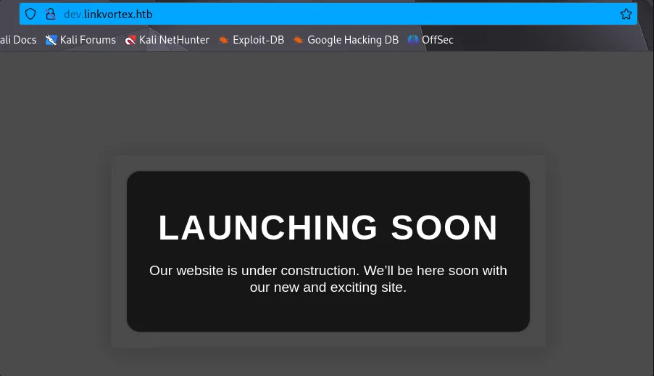

Al hacer un scaner en la pagina del subdominio encuentro rutas que van de un git. Para obtener esta información hay una herramienta creada en por un usuario de github, esta herramienta se llama Githack.

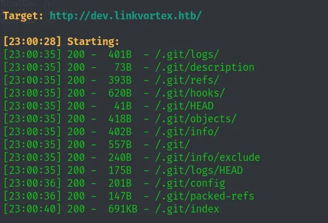
## *Análisis de vulnerabilidades*

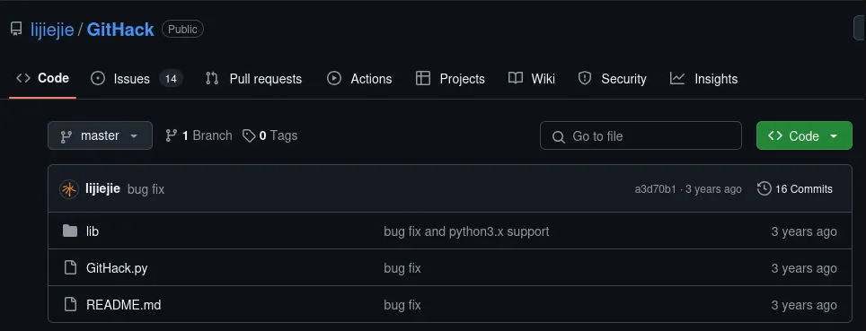

La herramienta está hecha en python, corremos el script e identificamos la dirección a la que necesitamos obtener la información del Git.

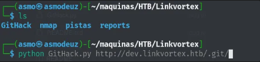

Cuando reviso los directorios que conseguí por el script me doy cuenta de una contraseña en un archivo Javascript.

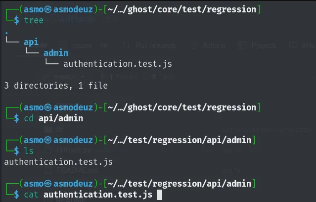

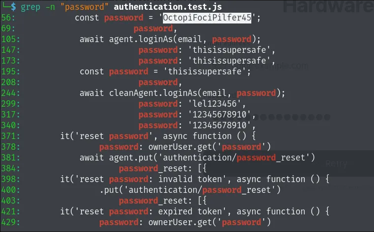

Utilizamos la contraseña encontrada para el correo del admin, este nos da acceso a su cuenta y buscamos la versión que corre su gestor.

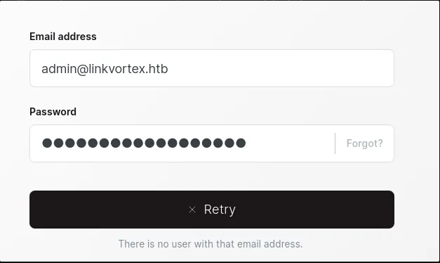


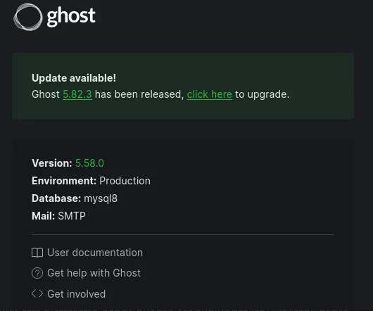

Después de esto es buscar una vulnerabilidad que pueda tener esta versión en github o cualquier otra plataforma donde puedan ser publicadas las vulnerabilidades.

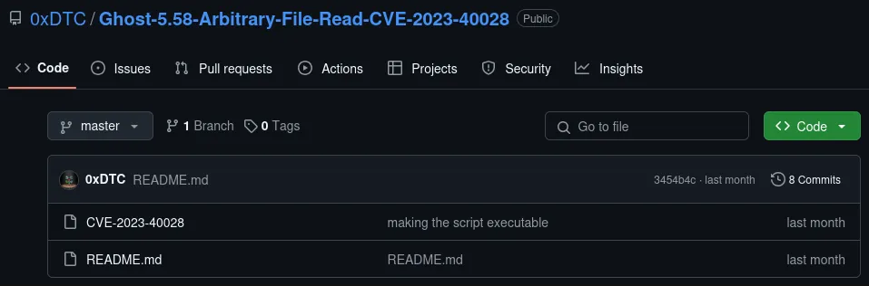
## *Explotación*

Para correr la siguiente vulnerabilidad debemos tener claro el usuario o correo, la contraseña y el host donde está la pagina alojada. Este script no dará la información de la ruta la cual queremos averiguar.

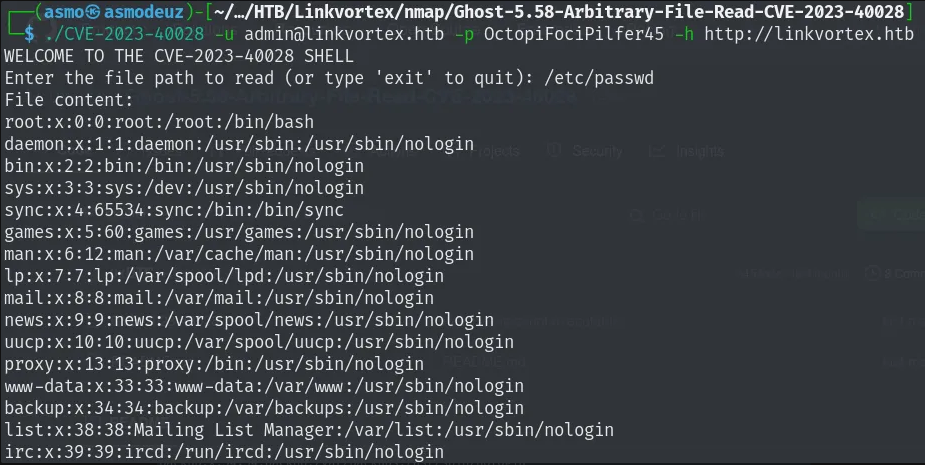

En los archivos hace tiempo extraídos en el githack podemos ver una configuración de la pagina Ghost, con el uso de la herramienta podemos dirigirnos a la ruta que deseemos. Utilizamos el script y este nos da las siguientes credenciales.

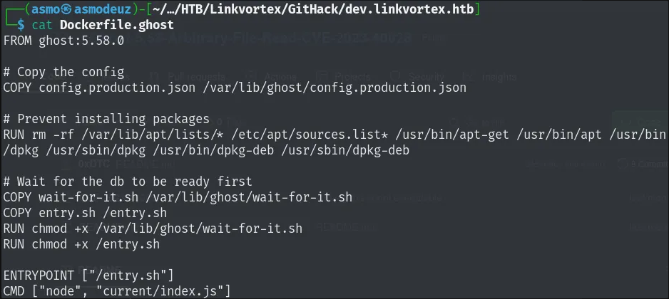
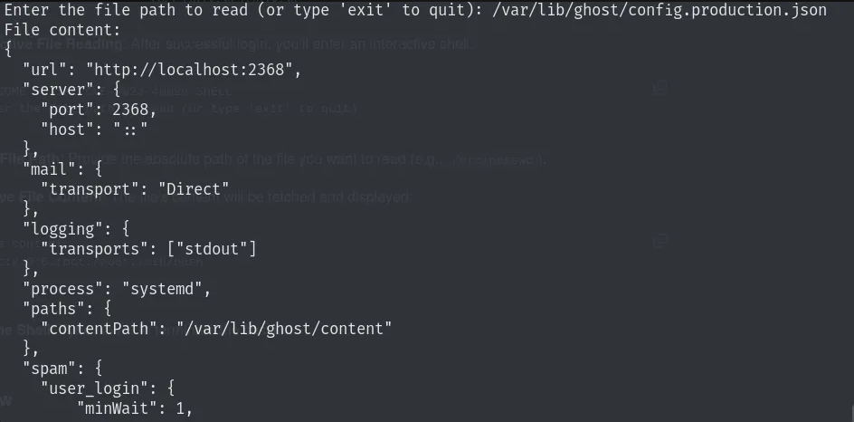
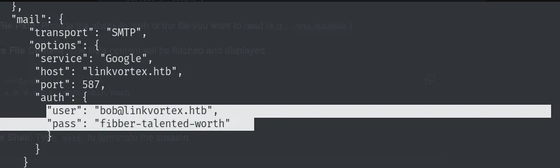

Con las credenciales obtenidas tenemos acceso al usuario bob y con ello a la primera flag de la maquina. Ahora lo que sigue es elevar privilegios y conseguir nuestra ultima flag.

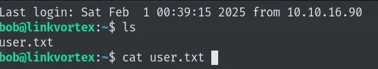

Con el comando sudo -l vemos que hay una manera de elevar privilegios , hay un ejecutable pero no sabemos que hace hasta el momento, vemos si tenemos permisos para ver el archivo e indagamos un poco.

Con ayuda de chatgpt se da más claro el objetivo del script:

> _Este script en **Bash** (`clean_symlink.sh`) está diseñado para **manejar enlaces simbólicos (`symlinks`) que apuntan a archivos PNG**. Su propósito es **verificar si un symlink apunta a archivos sensibles (en `/etc` o `/root`) y, en tal caso, eliminarlo**. Si no es un archivo crítico, lo mueve a una carpeta de **cuarentena** (`/var/quarantined`)._
## *Post-Explotación*

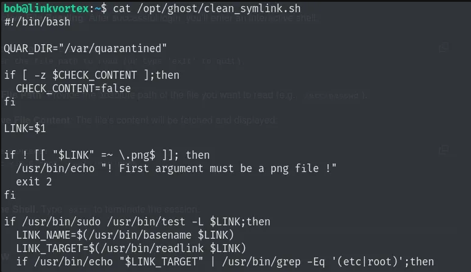

**Paso 1: Creación de los enlaces**

### **1️⃣ Comando 1**

```bash
ln -s /root/root.txt text.txt
```

- Creas un **symlink (`text.txt`) que apunta a `/root/root.txt`**.
- **Problema**: Si no eres root, **no puedes leer `/root/root.txt`**.

### **2️⃣ Comando 2**

```bash
ln -s /home/bob/text.txt test.png
```

- Creas otro **symlink (`test.png`) que apunta a `/home/bob/text.txt`**.
- Como `text.txt` ya es un symlink, **`test.png` indirectamente apunta a `/root/root.txt`**.

---

### **🛠️ Paso 2: Ejecución del script**

Si ejecutas:

```bash
sudo ./clean_symlink.sh test.png
```

El script hace lo siguiente:

1. **Verifica si el archivo termina en `.png`**
    
    ✅ **`test.png` termina en `.png`**, así que sigue.
    
2. **Verifica si es un enlace simbólico (`L test.png`)**
    
    ✅ **`test.png` es un symlink**, así que continúa.
    
3. **Obtiene el objetivo del enlace**
    
    ```bash
    LINK_TARGET=$(/usr/bin/readlink test.png)
    ```
    
    Como `test.png → text.txt → /root/root.txt`, el valor de `LINK_TARGET` es `/home/bob/text.txt`.
    
4. **Filtra enlaces peligrosos (`grep -Eq '(etc|root)'`)**
    
    - El script revisa si `LINK_TARGET` contiene `etc` o `root`.
    - Como **`/home/bob/text.txt` NO contiene esas palabras**, el script **no detecta peligro**.
5. **Mueve `test.png` a cuarentena (`/var/quarantined/`)**
    
    ```bash
    /usr/bin/mv test.png /var/quarantined/
    ```
    
    - **El symlink se mueve**, pero **su destino sigue siendo el mismo** (`/root/root.txt`).

---

### **📌 Resultado final**

📂 Dentro de `/var/quarantined/`, tienes:

```bash
ls -l /var/quarantined/
lrwxrwxrwx 1 root root 14 Feb 4 12:00 test.png -> /home/bob/text.txt
```

👀 **El enlace aún apunta a `/root/root.txt`**, pero ahora está en una carpeta diferente.

---

### **🔥 ¿Se puede explotar esto?**

Depende del contexto:

✅ **Si el script ejecuta `cat /var/quarantined/test.png` con `CHECK_CONTENT=true`**,

→ **Podría intentar leer `/root/root.txt` y exponer su contenido.**

❌ **Si `CHECK_CONTENT=false` y el admin no revisa la cuarentena, el ataque es inútil.**

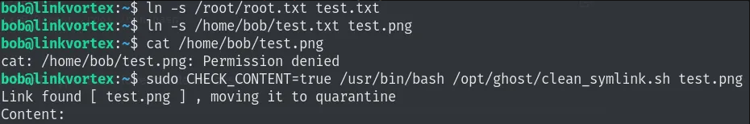