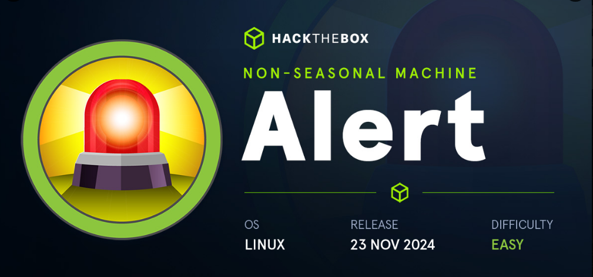

| MAQUINA |  OS   | DIFICULTAD |  PLATAFORMA  |    IP     |
| :-----: | :---: | :--------: | :----------: | :-------: |
|  ALERT  | LINUX |   FACIL    | HACK THE BOX | ALERT.HTB |
## *RECONOCIMIENTO*

Con el uso de Nmap identifico los puertos 22/SSH y 80/HTTP dentro de la maquina a vulnerar

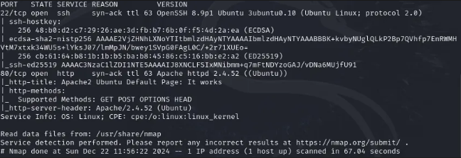
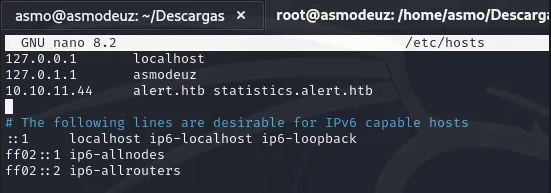

Hacemos un escaneo para buscar directorios con la herramienta Gobuster y buscar subdominios con Ffuf

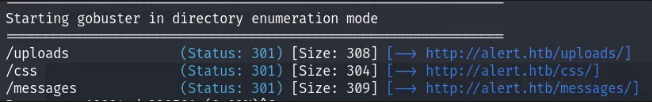
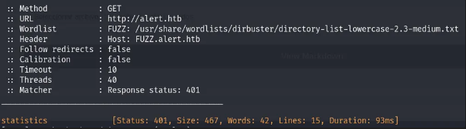

Revisando la pagina web tengo la siguiente información, una pagina donde puedo ingresar un archivo, solo se admite plantillas con formato `.md`

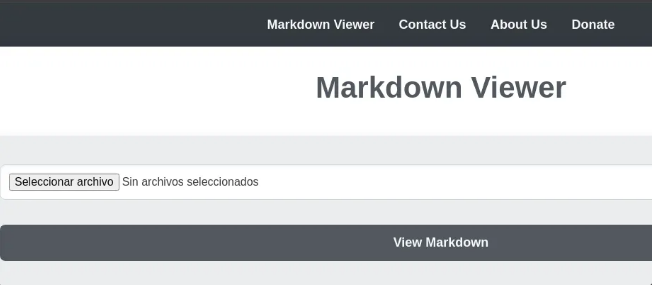

Aunque no encontré información sobre el subdominio statistics puedo ver que maneja usuarios en la pagina web.

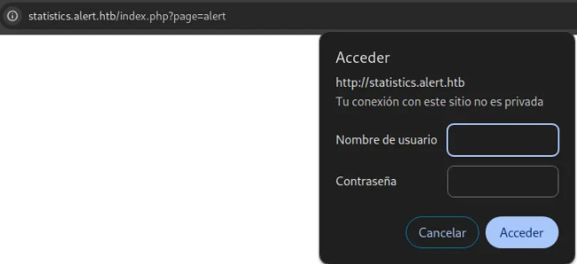

## *ANALISIS DE VULNERABILIDADES*

Creamos una payload para indagar si hay manera de conseguir algo de la ruta /etc/passwd, enviamos ese archivo y nos envía una redirección que nos pide compartir la plantilla.

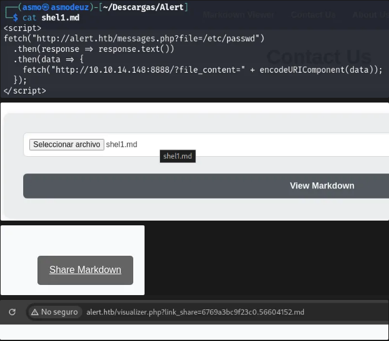

Hay un directorio para contactar a la persona, ya sea para sugerir o preguntar algo, utilizo el link de compartir sobre el payload que sea había creado.

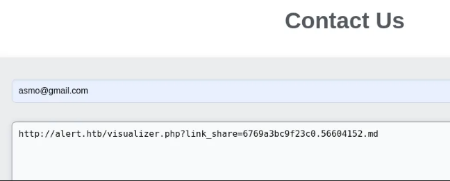

Antes de enviar el mensaje ejecuto un servidor en python con el mismo puerto en donde el payload aparece, en respuesta encuentro la ruta /etc/passwd y sus usuarios. Estos datos estaban codificados, al decodificar encontramos la información más clara.

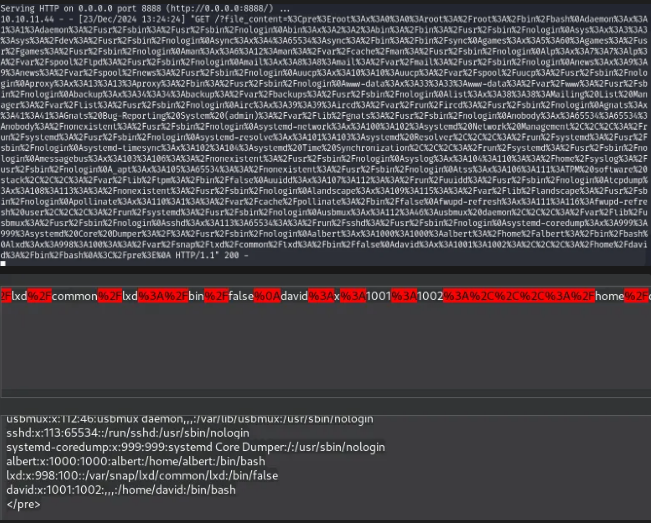

El archivo `.htpasswd` es un componente usado en conjunto con `.htaccess` para implementar autenticación básica basada en HTTP en servidores web. Este archivo contiene nombres de usuario y contraseñas (../../image/generalmente cifradas) para controlar el acceso a áreas protegidas del servidor.

Observando que nuestro primer intento funciona podemos hacer una edicion para obtener el archivo .htpasswd, este archivo se encuentra en servidores Apache HTTP Server, Nginx, LiteSpeed.

### **Dónde buscar el archivo en un servidor**

1. **Ubicación estándar**:
    - Generalmente fuera del directorio público para evitar acceso directo.
    - Rutas comunes: `/etc/`, `/var/www/`, `/home/user/`.
2. **Búsqueda manual**:
    - Usa el comando `find` para localizarlo:
```bash
    - find / -name ".htpasswd" 2>/dev/null
```
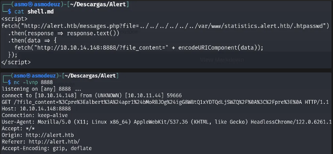

Ahora tenemos un usuario y contraseña, a simple vista puedo ver que la contraseña está encodeada en MD5.

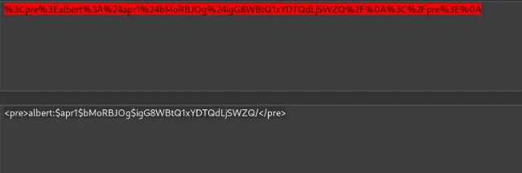

## *EXPLOTACIÓN*

Guardando la información del hash en un text, utilizo la herramienta john the ripper para encontrar la contraseña que está codificada.

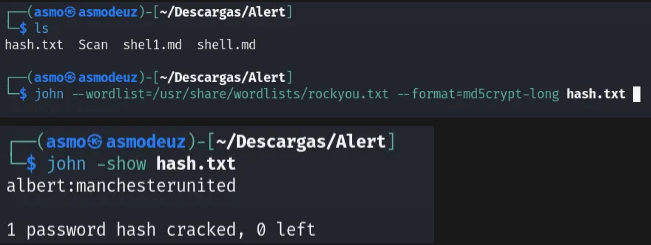

Con la contraseña encontrada nos dirigimos al puerto ssh para buscar la primera flag y buscar la forma de elevar privilegios.

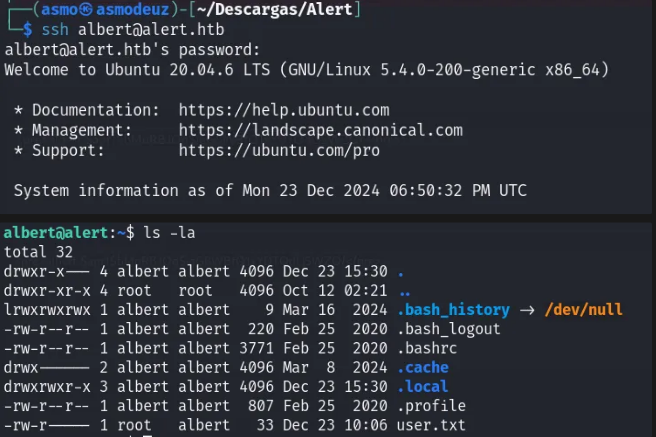

## Post-Explotacion

Al no tener comandos dentro del usuario albert para elevar privilegios comencé a buscar informacion en carpetas externas de Albert, cuando entro a la carpeta opt me muestra carpetas.

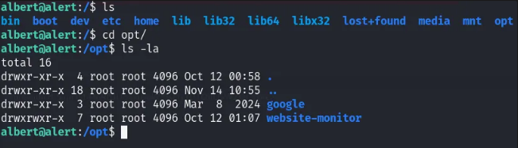

En la carpeta website-monitor solo me da opcion de ingresar a la carpeta config, hay un archivo el cual puedo ver.

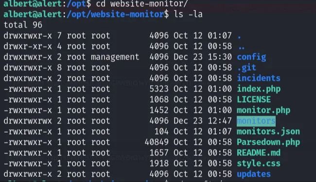

Este archivo es llamado desde el website-monitor y nos dirige a la pagina principal del config.php, podemos decir que hay una pagina corriendo en estos momentos y me dispongo a editar el contenido e implementar una reverse shell, antes de guardarlo me pongo en escucha con el puerto 4444 y guardo el archivo editado, se ejecuta instantaneamente y me da acceso al root.

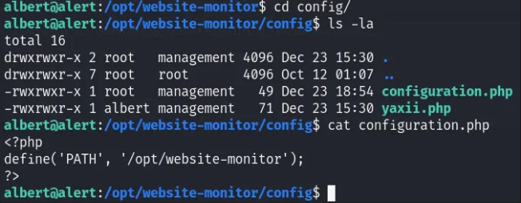
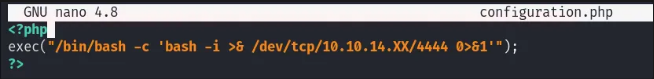
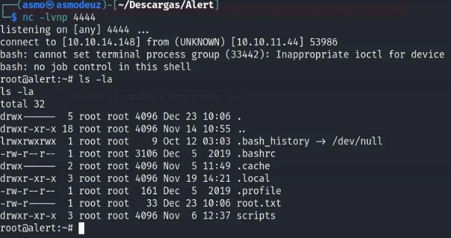


