| MAQUINA |  OS   | DIFICULTAD |  PLATAFORMA  |     IP     |
| :-----: | :---: | :--------: | :----------: | :--------: |
|  Lame   | Linux |   Facil    | Hack The Box | 10.10.10.3 |
## *Reconocimiento*

En esta fase utilizo Nmap para encontrar los puertos que pueden estar abiertos en la maquina. 

**-sV**: Me da la versión del servicio que se está ejecutando en el puerto.

**-A** : Opciones de sondeos agresivos, más detalles dentro del escaneo.

**-p-** : Hace un escaneo a todos los puertos y me regresa los que tiene respuesta.

**--open**: > **Muestra solo los puertos _abiertos_** en los resultados.

**-n**: Le indica a Nmap que _nunca_ debe realizar resolución DNS inversa de las direcciones IP activas que encuentre. Ya que DNS es generalmente lento, esto acelera un poco las cosas.

**--min-rate**: Fuerza una velocidad mínima de paquetes por segundo durante el escaneo.

**-oN**: Guardar el sondeo en formato normal.

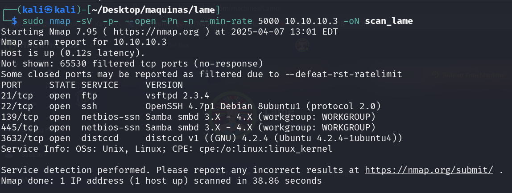

Aunque el primer escaneo fue exitoso no puede tener claro la versión en los puertos 139 y 445, asi que uso la flag -A para tener un escaneo más detallado.

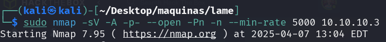
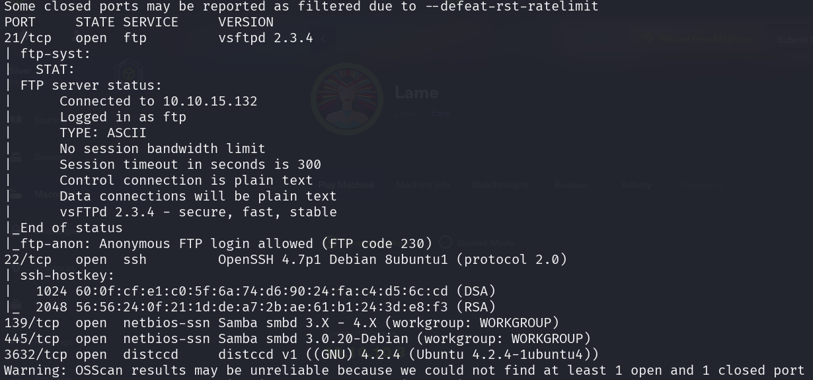

Con las versiones obtenidas puedo hacer una búsqueda en searchsploit para averiguar si hay algún reporte sobre un exploit hacia el servicio.

## *Analisis de vulnerabilidades*

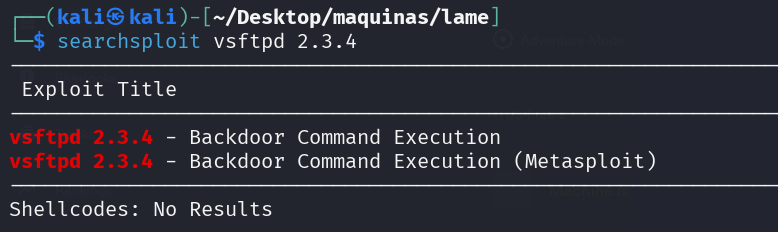

Veo que tengo un exploit en metasploit, asi que me dirijo a ver si funciona para la maquina.

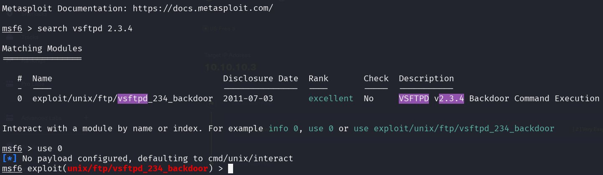

Por defecto nos viene una configuración, lo que sigue es modificarla de acuerdo a la dirección IP de la maquina victima. Pero al correr el exploit parece que no hace una conexión al puerto 21.

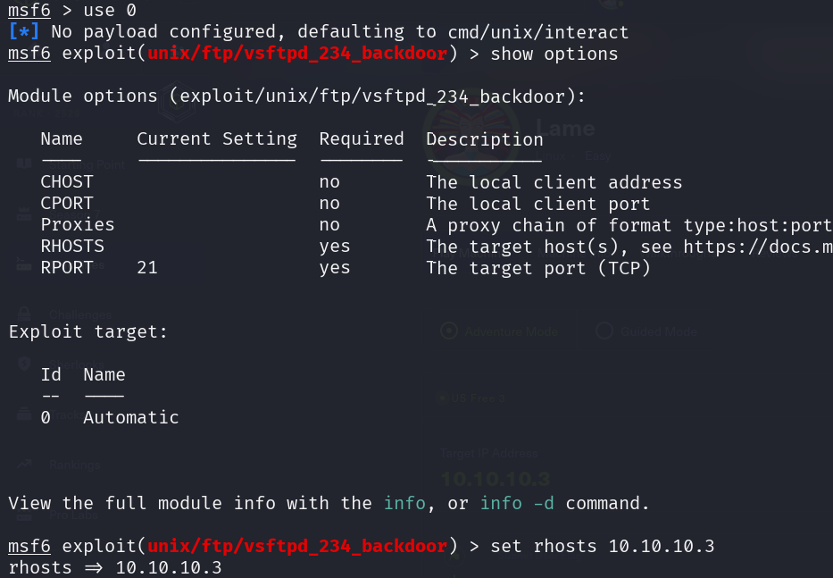
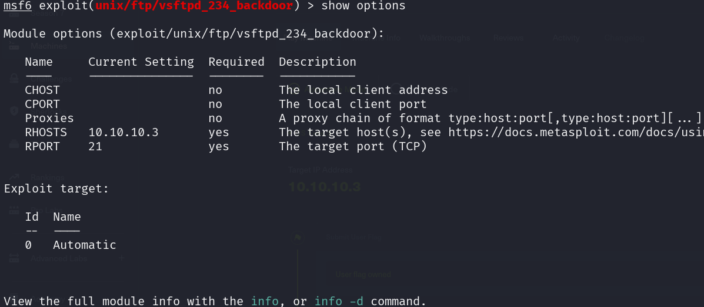
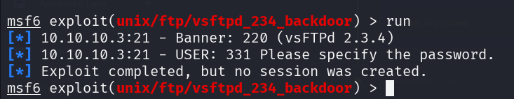

En el escaneo que hice en Nmap  había un versión de un servicio de Samba, probé suerte y encontré un exploit sobre este servicio.

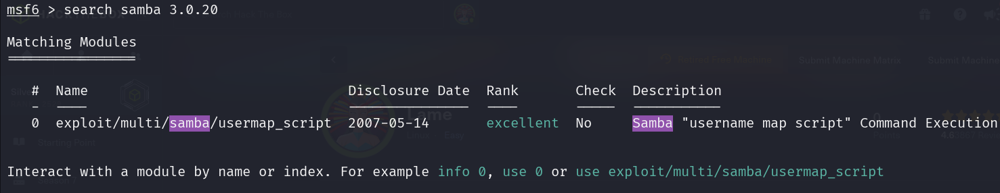

Aquí tendria que modificar más cosas, como el RPORT: 445, RHOSTS: IP-Victima, LHOST: IP-Atacante.

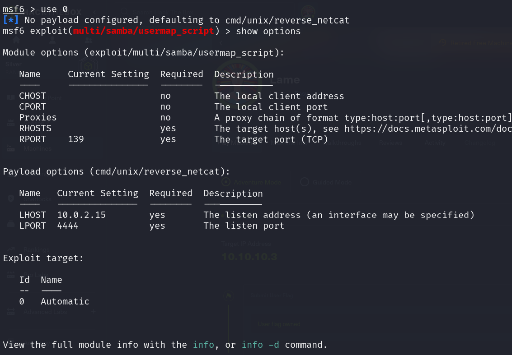
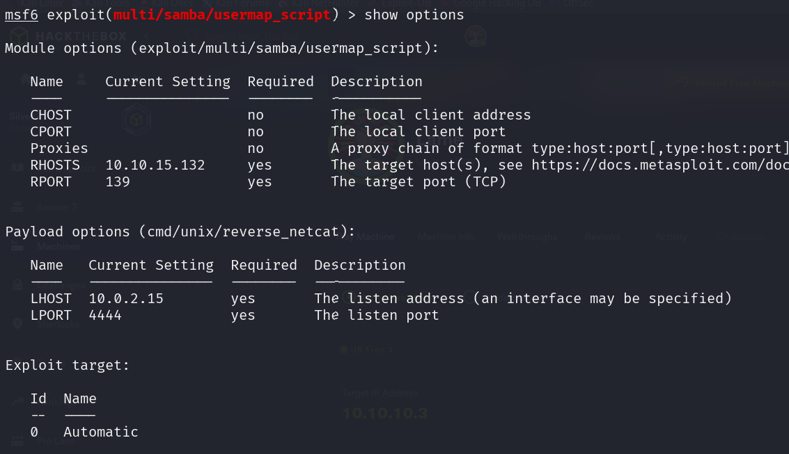

## *Explotación*

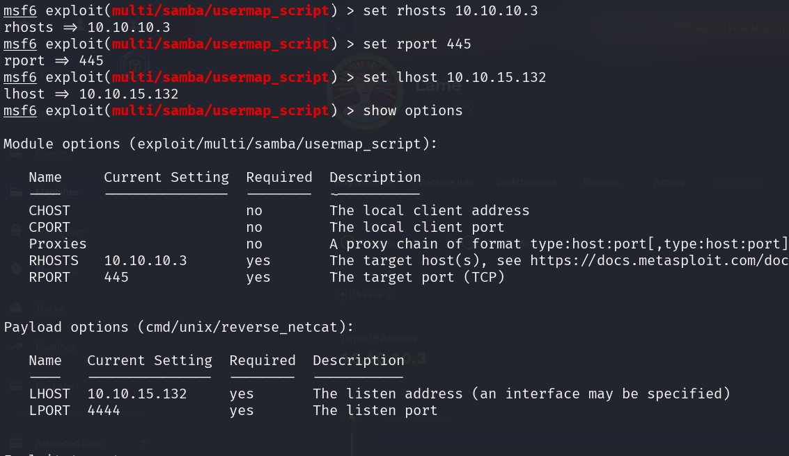

Ejecuto el exploit y tengo una sesion iniciada hacia la maquina victima, con el comando en python obtuve una shell y ahora puedo trabajar de una mejor manera.

```python
python -c 'import pty; pty.spawn("/bin/sh")'
```

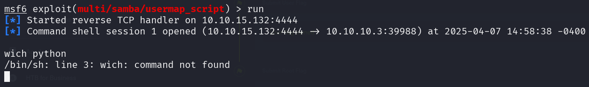
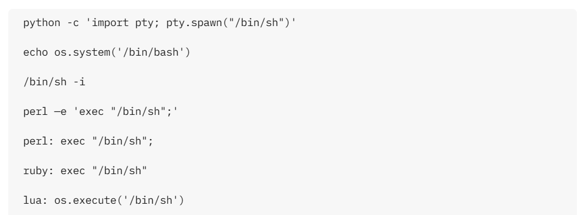

Al revisar sobre que usuario estoy ejecutando la shell me muestra que soy **Root**. Con esto puedo moverme por las carpetas con más libertad. Encuentro al usuario Makis y obtengo su flag.

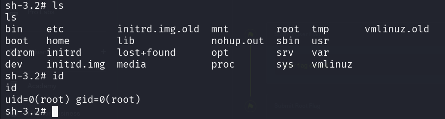
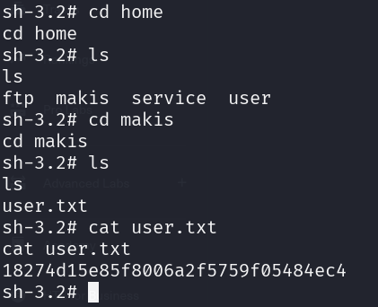

## *Post-Explotación*

Al mismo tiempo y sin moverme por las carpetas uso el comando cat para que me muestro el contenido del archivo root.txt que se encuentra alojado en el directorio root/.

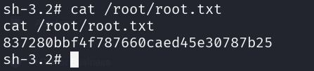
