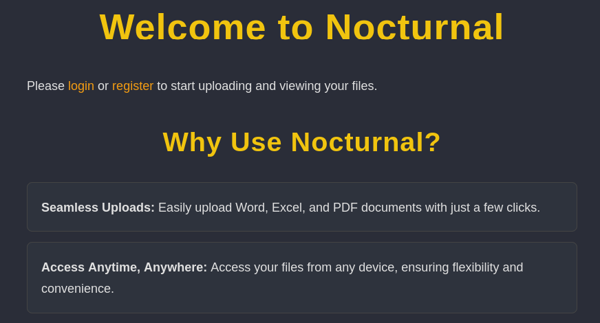
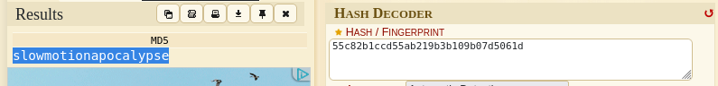

|  MAQUINA  |  OS   | DIFICULTAD |  PLATAFORMA  |     IP      |
| :-------: | :---: | :--------: | :----------: | :---------: |
| Nocturnal | Linux |   Facil    | Hack the box | 10.10.11.64 |
## *RECONOCIMIENTO*

Con ayuda en Nmap hice el escaneo a la dirección IP que nos entrega Hack the box.


La pagina principal nos da la bienvenida y nos da una explicación de las ventajas de usar la pagina. Se puede ver también que hay dos opciones una para ingresar a una cuenta existente y otra para registrarnos.



Al hacer una enumeración de directorios tenemos como resultado 3 posibles rutas, pero cada una de estas nos da como resultado el no estar permitidas.


Como no tengo usuario me voy a registrar, inicio sesión con las credenciales que recién cree y tenemos nuestro perfil con la opción de cargar archivos a la pagina.


## *ANALISIS DE VULNERABILIDADES*

A primera vista pensé que se podía tratar de una vulnerabilidad de File Inclusion. Asi que creo un archivo con extensión .php y me dispongo a cargarlo en la pagina.


La pagina contiene una restricción sobre ciertas extensiones y menciona cuales son las aceptadas


En ocasiones la extensión phtml puede pasar los filtros y cuando se ejecuta lo hace como un archivo PHP, ocurre lo mismo que antes y no me da permisos. Otra forma de ingresar un archivo es añadirle otra extensión que esté permitida en la pagina.


El archivo como se puede ver tiene la extensión PHP y DOC, pero la pagina solo está detectando la ultima extensión y deja pasar el archivo. Cuando damos click en el archivo recién cargado nos redirige a una descarga de este mismo, así que por esa parte no hay forma de hacer una reverse shell.


Cuando pasamos el cursos en el archivo se puede ver en la parte inferior el enlace que genera la descarga del archivo, este se copiará y se le hará fuzzing para encontrar algún otro posible usuario, no hay que olvidar que estoy registrado y tengo una cookie, también la voy a utilizar.


Con la herramienta Ffuf podemos hacer ataques de fuerza bruta para la búsqueda de directorios en una pagina, pero en este caso también se puede hacer para detectar usuarios.
Seclists trae varios archivos con los cuales podemos escoger el que creamos más conveniente, al añadir también la cookie pues aseguro que mi cuenta todavía se mantenga en sesión mientras hace el análisis.

```bash
ffuf -u 'http://nocturnal.htb/view.php?username=FUZZ&file=reverse.php.doc' -w /usr/share/seclists/Usernames/xato-net-10-million-usernames-dup.txt -fs 2985 -t 60 -H "Cookie: PHPSESSID=19j30sh8ahgriddg8skqmuh7hj"
```

Encontramos 3 usuarios, si utilizamos el archivo el cual redirecciona a la descarga pero le cambiamos el nombre produce un error donde indica que el archivo en uno de esos usuarios no fue encontrado. Pero dentro de esos usuarios encontramos archivos, por ejemplo el de Amanda.


No estoy como tal en el usuario amanda, pero puedo ver un archivo odt, lo descargo y lo descomprimo.


Con uso de grep puedo buscar información precisa de lo que necesito, en esta ocasión seria la palabra contraseña, en el archivo content.xml puedo ver un enunciado hacia amanda en donde le informan que las credenciales de su cuenta deben ser cambiadas, pero que para iniciar sesión le otorgan una que está en ese mensaje.


Con las credenciales obtenidas me dispongo a ingresar en la cuenta de amanda y veo que tiene cierto permiso de administrador.

```
amanda:arHkG7HAI68X8s1J
```


Al ingresar al admin panel se encuentra como está estructurada la pagina, tambien tengo la opción de ver el contenido de cada archivo.


Encuentro en el archivo view.php una ruta que indica que una base de datos.


Hay otra opción en el admin panel la cual es crear un backup de los archivos que estoy viendo y que hacen parte de la pagina. Si ingreso una clave cualquiera y le doy a crear Backup me da una salida de los archivo que estarán siendo descargados si confirmo la descarga.


Con el uso de Burpsuite puedo interceptar la petición al crear el backup y en la parte de la contraseña hacer un bypass. Este payload tiene una petición de buscar la base de datos, dumpearla y enviar a la carpeta tmp un archivo con toda la información.

```bash
%0Abash%09-c%09"sqlite3%09/var/www/nocturnal_database/nocturnal_database.db%09.dump%09>%09/tmp/nocturnal.txt"%0A
```


De ahí obtengo 3 usuarios con sus contraseñas hasheadas. Lo siguiente es probar en alguna herramienta de la web o el kali estas credenciales y utilizarlas a conveniencia.


## *EXPLOTACIÓN*

Al probar los hash de los usuarios encontrados me da un resultado la contraseña de tobias. Esta contraseña la guardé y la utilicé en el puerto SSH dado que dentro de los primeros pasos ese puerto está activo y resultó que este contraseña dió acceso al ssh de tobias.




Durante un nuevo reconocimiento de redes, encontré que el puerto 8080 estaba activo


## *POST-EXPLOTACIÓN*

Sin embargo, el servicio solo estaba disponible localmente, así que utilicé SSH Port Forwarding para exponer el puerto local 8080 a mi máquina atacante.


Ahora pude acceder a http://127.0.0.1:8080 y me mostró una página de login de ISPConfig. Al inspeccionar la página, pude ver que la versión de ISPConfig era 3.2.10p1.


Con la versión de ISPConfig identificada como 3.2.10p1, investigué vulnerabilidades conocidas para esta versión y encontré una interesante: CVE-2023-46818, que permite RCE/PHP Code Injection. El exploit se aprovecha de la falta de sanitización de la entrada del usuario en el parámetro records de la página de administración ( /admin/language_edit.php ). Un atacante con privilegios de administrador puede inyectar código PHP malicioso a través de este parámetro y ejecutarlo en el servidor.

https://github.com/bipbopbup/CVE-2023-46818-python-exploit/blob/main/exploit.py


Copio el exploit en la maquina tobias y edito el codigo conforme necesito hacer el ataque al usuario admin, consigo el acceso y con esto consigo la flag root.


