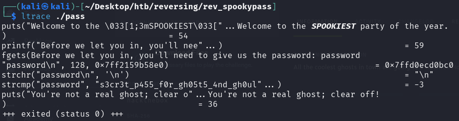

Este es uno de los muchos retos que hay en Hack the box, este reto trata sobre reversing y directamente no es como las maquinas virtuales.
La plataforma nos trae un archivo zip el cual debemos descomprimir en nuestro ordenar, este nos deja una carpeta e ingresamos a ella

La carpeta tiene un ejecutable llamado *pass*, al ingresar me pide una contraseña que no tengo 

La herramienta **LTRACE** nos permite rastrear las llamadas a funciones de bibliotecas dinámicas que hace un programa en ejecución.
Cuando escribo una contraseña mal, sigue ejecutándose el programa pero esta vez nos muestra cual es la posible contraseña que nos daría acceso.
Aunque la contraseña al parecer esta siendo mostrada no me da acceso.

Otra forma de poder ver los datos dentro de un ejecutable sin desensamblarlos es con el comando **strings**, aquí también encuentro la contraseña y el carácter que faltaba para que me diera entrada. Ya con esto consigo la flag y termina el reto.

Otra herramienta que puede ayudarme para este reto es **RADARE2** es un framework de código abierto para ingeniería inversa.

Abro un ejecutable sin ejecutarlo y de paso analizo el binario completamente

Busco las funciones detectadas en este ejecutable 

Desensamblo la entrada main donde posiblemente puede estar la información del script y mientras scrolleo puedo encontrar tanto la contraseña como la flag.

