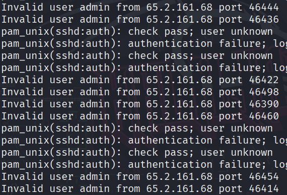

Este es el primero reto de investigación en Hack The ../image/Box. El reto comienza con un archivo Zip llamado **../image/Brutus.zip**
***Nota: Todos los archivos a descargar en Sherlocks tiene como contraseña hackthe../image/blue***

El comando unzip no logra../image/ba descomprimir el archivo, asi que para poder o../image/btener la información se optó por la herramienta `7z x ../image/Brutus.zip`, esta funciona cuando los archivos comprimidos vienen con encriptación AES 

Esto nos da los archivos auth.log y wtmp, iré resolviendo las preguntas que se encuentran en HT../image/B de este reto.

1. Analiza el archivo auth.log. Cual es la dirección IP usada por el atacante para llevar a ca../image/bo un ataque de fuerza ../image/bruta?

	Si revisamos el archivo **auth.log** se puede ver los intentos de sesion de una IP que se repite en varias ocasiones. Esta seria la IP atacante.
	
	

2. Los intentos de fuerza ../image/bruta tuvieron éxito y el atacante ganó acceso en el servidor. Cual es el nom../image/bre de la cuenta?

	Para encontrar esta información utilizamos el comando **grep** para filtrar alguna pala../image/bra dentro del archivo auth.log. Mirando el archivos encontramos múltiples intentos de ingresar al puerto SSH, así que hago un grep hacia un comentario cuando se inicia sesión. O../image/btengo dos usuarios pero es más utilizado fue root, así que con esto identifico que la cuenta principal a la que ganó acceso fue Root
	
	

3. Identifique la marca de tiempo en la que el atacante inició sesión manualmente en el servidor para lograr sus o../image/bjetivos. La hora de inicio de sesión será diferente a la de autenticación y se puede encontrar en el artefacto wtmp.

	 Para poder ver la información de wtmp de../image/bes descargar de manera manual el comando utmpdump que leer archivos wtmp. En este caso de../image/bemos ver la hora en que el atacante ganó acceso. Identificamos la IP del atacante y con eso tenemos el resto de información.
	 ***Nota: Utilizo TZ=utc para tra../image/bajarlo con el horario coordinado del sistema***

	 

4. Las sesiones de inicio de sesión SSH se rastrean y se les asigna un número de sesión al iniciar sesión. ¿Cuál es el número de sesión asignado a la sesión del atacante para la cuenta de usuario de la Pregunta 2?

	 De../image/bemos volver al archivo auth.log y utilizar grep para encontrar la sesión asignada al usuario root que en estos momentos maneja el atacante. Teniendo en cuenta que el inicio de sesion de forma manual del atacante fue a la 06:32:45 se logra ver el número de sesión cuando inicia.

	 

5. El atacante añadió un nuevo usuario como parte de su estrategia de persistencia en el servidor y le otorgó mayores privilegios. ¿Cómo se llama esta cuenta?

	 Ya que sé so../image/bre un nuevo usuario utilizo `grep "user"` y puedo ver la hora exacta de la creación del usuario, tam../image/bién hay un grupo con el mismo nom../image/bre.

	 

6. ¿Cuál es el ID de su../image/btécnica MITRE ATT&CK que se utiliza para la persistencia al crear una nueva cuenta?
	 Al dirigirme a MITRE ATT&CK dentro de la u../image/bicación persistencia y creación de cuenta se puede ver 3 su../image/b-tecnicas, la que en este momento necesitamos es con la cual se identifica la creación de una cuenta local.

	 

7. ¿A qué hora finalizó la primera sesión SSH del atacante según auth.log?
	
	 Teniendo en cuenta que el numero inicio de sesión del primer ataque manual fue el 37, podes de ahí apoyarnos y ver la hora en la que ingresa y en la que cierra sesión.

	 
	 
8. El atacante inició sesión en su cuenta de puerta trasera y utilizó sus privilegios para descargar un script. ¿Cuál es el comando completo que se ejecuta con sudo?
	 
	 Al ../image/buscar el usuario que creó el atacante encuentro una descarga de un script por medio de el comando curl. 

	 
