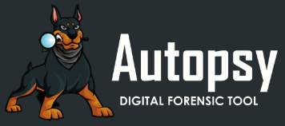

## DFIR(Investigacion Forense Digital y Respuesta a Incidentes)

Su campo cubre la colección de artefactos forenses de dispositivos digitales como lo son computadores, dispositivos de medios de comunicación y celulares inteligentes para la investigación de incidentes. Este campo ayuda a profesionales de la seguridad a identificar huellas dejadas por un atacante cuando ocurre un incidente de seguridad.

## La necesidad de DFIR 

Los profesionales de la seguridad ayudan en varias rutas, como las siguientes:

- Encontrar evidencias de la actividad de un atacante en la red y filtrar alarmas falsas de incidentes actuales.
- Eliminación robusta del atacante, así como su acceso o punto de apoyo en un sistema objetivo de la red.
- Identificando el alcance y el plazo de una brecha. Esto ayudara a la comunicación con partes interesadas relevantes.
- Encontrando las lagunas que condujo a la brecha. Que se necesita cambiar para evitar otra brecha en el futuro?
- Entender el comportamiento del atacante para de forma preventiva bloquear mas intentos de intrusión por el atacante.
- Compartir información sobre el atacante con la comunidad.

## Quien realiza el DFIR?

***Forenses Digitales***: Estos profesionales son expertos en identificar artefactos forenses o evidencias de actividad humana en dispositivos digitales.

***Respuesta de Incidentes***: Los Incidentes de respuesta son expertos en ciberseguridad y aprovechan la información forense para identificar la actividad de interés desde una perspectiva de seguridad.

## Herramientas DFIR

**Eric Zimmerman's Tools**: es un buscador de seguridad el cual tiene escrito unas cuantas herramientas que ayudan a la realización de análisis forenses en plataformas windows. Estas herramientas ayudan a los registros, archivos de sistema, líneas de tiempo, y muchos otros análisis.

**Kape:** Analizador y extractor de artefactos Kroll es otra herramienta hecha por Eric Zimmerman. Esta herramienta automatiza la recolección y el análisis de artefactos forenses que puedan ayudar a crear una linea de tiempo de eventos.

**Autopsy:** Es una plataforma forense de código abierto que ayuda al análisis de medios de comunicación como dispositivos móviles, disco duros, unidades extraíbles. Varios plugins pueden acelerar el proceso forense de extracción y presentar información valiosa de las fuentes de datos sin procesar.

**Volatility:** esta herramienta ayuda a llevar a cabo análisis de memoria para capturas de memoria de ambos sistemas operativos Windows y Linux. Esta es una poderosa herramienta que pueda ayudar a extraer información importante de la memoria de una maquina dentro de la investigación.

## Proceso de Respuesta de Incidente

Diferentes organizaciones han publicado métodos estandarizados para realizar la Respuesta a Incidentes. El NIST ha definido un proceso en su guía de manejo de incidentes SP-800-61, que consta de los siguientes pasos:

1. Preparación
2. Detección y análisis
3. Contención, erradicación y recuperación
4. Actividad posterior al incidente

De igual manera, SANS ha publicado un manual para el gestor de incidentes. Este manual define los pasos de la siguiente manera:

1. **Preparación**: Antes de que ocurra un incidente, es necesario prepararse para que todos estén listos en caso de que ocurra. La preparación incluye contar con el personal, los procesos y la tecnología necesarios para prevenir y responder a incidentes.
2. **Identificación**: Un incidente se identifica mediante indicadores en la fase de identificación. Estos indicadores se analizan para detectar falsos positivos, se documentan y se comunican a las partes interesadas pertinentes.
3. **Contención**: En esta fase, se contiene el incidente y se realizan esfuerzos para limitar sus efectos. Se pueden implementar soluciones a corto y largo plazo para contener la amenaza, basadas en el análisis forense del incidente que formará parte de esta fase.
4. **Erradicación**: A continuación, se erradica la amenaza de la red. Es necesario garantizar que se realice un análisis forense adecuado y que la amenaza se contenga eficazmente antes de la erradicación. Por ejemplo, si el punto de entrada del agente de la amenaza a la red no está bloqueado, la amenaza no se erradicará eficazmente y el agente podrá volver a establecerse.
5. **Recuperación**: Una vez eliminada la amenaza de la red, los servicios interrumpidos se restablecen a su estado anterior al incidente.
6. **Lecciones aprendidas**: Finalmente, se realiza una revisión del incidente, se documenta y se toman medidas con base en sus hallazgos para garantizar que el equipo esté mejor preparado para la próxima vez que ocurra un incidente.
