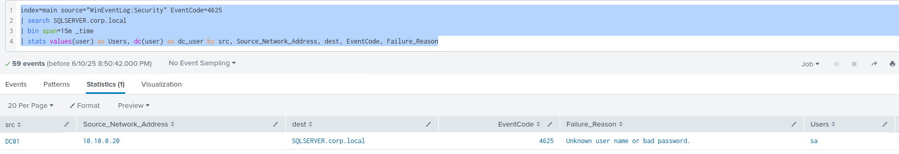
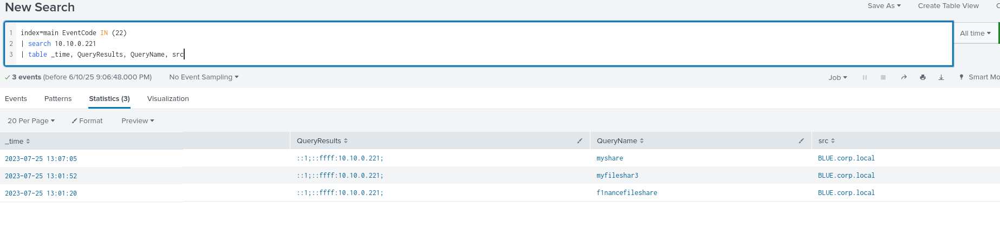
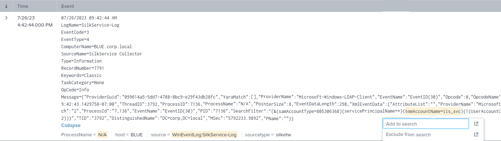
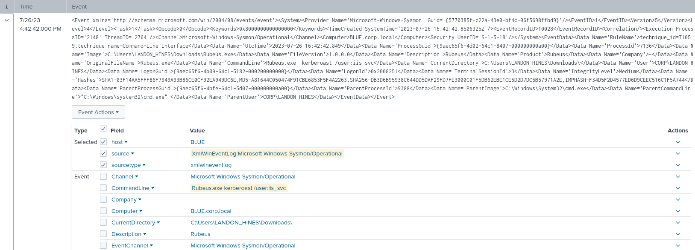

**Splunk es una plataforma de análisis de datos en tiempo real**, especialmente diseñada para recolectar, indexar, buscar, visualizar y analizar grandes volúmenes de datos generados por máquinas (logs, eventos, métricas, etc.).

## **¿Para qué se usa en ciberseguridad (SOC)?**

Splunk funciona como un **SIEM** (Security Information and Event Management), lo cual lo hace ideal para:

✅ **Monitorear eventos de seguridad**  
✅ **Detectar actividades sospechosas y amenazas**  
✅ **Correlacionar eventos entre distintos sistemas**  
✅ **Crear alertas personalizadas**  
✅ **Visualizar en dashboards ataques, incidentes y estadísticas de red**

### **¿Qué puede recolectar Splunk?**

- Logs de Windows (`eventvwr`)
- Logs de Linux (`/var/log/`)
- Tráfico de red (usando herramientas como Zeek o Suricata)
- Logs de firewall, IDS, antivirus, proxies
- Datos de servicios en la nube (AWS, Azure, GCP)
- Información de endpoints con Splunk Universal Forwarder

# Busquedas Comunes en Windows

### **Deteccion de BloodHound**

El recopilador BloodHound ejecuta númerosas consultas LDAP dirigidas al controlador de dominio, con el objetivo de acumular información sobre el dominio.
Windows puede sugerir usar el registro de supervision del rendimiento de LDAP `Event 1644`. Aun con ello puede que no se generen muchos de los eventos.

| 🧭 **Objetivo**                                            | 🔍 **Filtro LDAP / Tool**                          | 💡 **SPL en Splunk (equivalente)**                                         | 📝 **Notas / Eventos clave**                                                           |
| ---------------------------------------------------------- | -------------------------------------------------- | -------------------------------------------------------------------------- | -------------------------------------------------------------------------------------- |
| 🔑 Buscar usuarios con `pass` en descripción o comentarios | `(                                                 | (description=_pass_)(comment=_pass_))`**Metasploit**                       | `index=wineventlog (description="*pass*" OR comment="*pass*")`                         |
| 🖥️ Enumerar computadoras Windows Server                   | `(operatingSystem=*server*)`**Metasploit**         | `index=wineventlog operatingSystem="*Server*"`                             | Alternativo: buscar hosts con nombre `SRV` o eventos de logon tipo server.             |
| 👥 Enumerar grupos de AD                                   | `(objectClass=group)`**Metasploit**                | `index=wineventlog (EventCode=4731 OR EventCode=4732 OR EventCode=4733)`   | 4731 = Grupo creado4732 = Usuario agregado4733 = Usuario removido                      |
| 🧑‍💼 Grupos con `managedBy`                               | `(objectClass=group)(managedBy=*)`**Metasploit**   | No directo en Splunk sin integración LDAP.Alternativa: `EventCode=4728`    | Para ver cambios en grupos de seguridad (requiere logging de AD detallado).            |
| 🖧 Enumerar computadoras                                   | `sAMAccountType=805306369`**PowerView**            | `index=wineventlog EventCode=4624 Logon_Type=3``                           | stats count by host`                                                                   |
| 👤 Enumerar usuarios de dominio                            | `samAccountType=805306368`**PowerView**            | `index=wineventlog EventCode=4720 OR EventCode=4722 OR EventCode=4723`     | 4720 = Usuario creado4722 = Habilitado4723 = Cambio de password                        |
| 🎭 Buscar SPNs (Kerberoast)                                | `servicePrincipalName=*`**PowerView**              | `index=wineventlog EventCode=4769`                                         | TGS requested (Kerberos), clave para ataques de SPN                                    |
| 📂 Buscar DFS Shares                                       | `objectClass=msDFS-Linkv2`**PowerView**            | `index=* "DFS"`                                                            | Solo si hay eventos relacionados con DFS; también buscar acceso SMB (`EventCode=5140`) |
| 🗃️ Enumerar Organizational Units (OUs)                    | `(objectCategory=organizationalUnit)`**PowerView** | No directo sin integración con AD schema.Alternativa: ver `EventCode=5136` | 5136 = Cambios en objetos del directorio                                               |
| 🔍 Buscar usuarios con `samAccountType=805306368`          | `samAccountType=805306368`**Empire**               | `index=wineventlog EventCode=4720 OR EventCode=4722`                       | Eventos de usuario, útil para detectar cambios sospechosos                             |

**EventCodes más usados en Splunk para ataques AD**

| 🛠️ **Acción**                    | ⚙️ **EventCode** | 📌 **Descripción**      |
| --------------------------------- | ---------------- | ----------------------- |
| Inicio de sesión exitoso          | `4624`           | Revisión de logins      |
| Fallo de login                    | `4625`           | Intentos fallidos       |
| Creación de usuario               | `4720`           | Nuevo usuario           |
| Cambio de contraseña              | `4723`, `4724`   | Modificaciones de pass  |
| Creación de grupo                 | `4731`           | Nuevos grupos           |
| Usuario agregado a grupo          | `4728`, `4732`   | Privilegios modificados |
| Solicitud de TGS (SPN)            | `4769`           | Para Kerberoasting      |
| Acceso a recurso compartido (SMB) | `5140`           | DFS, C$ y otros shares  |

# Detección de rociado de contraseñas

Este es muy diferente a los ataques de fuerza bruta donde un atacante prueba numerosas contraseñas hacia una sola cuenta de usuario.
Un patrón que se asocia mucho es el intento fallido de inicio de sesión `Event ID 4625 - Failed Logon`.

Otros registros de eventos que pueden ayudar a la detección de robo de contraseñas:

- `4768 and ErrorCode 0x6 - Kerberos Invalid Users`
- `4768 and ErrorCode 0x12 - Kerberos Disabled Users`
- `4776 and ErrorCode 0xC000006A - NTLM Invalid Users`
- `4776 and ErrorCode 0xC0000064 - NTLM Wrong Password`
- `4648 - Authenticate Using Explicit Credentials`
- `4771 - Kerberos Pre-Authentication Failed`

### **Búsqueda de rociado de contraseñas con Splunk**

```bash
index=main earliest=1690280680 latest=1690289489 source="WinEventLog:Security" EventCode=4625
| bin span=15m _time
| stats values(user) as Users, dc(user) as dc_user by src, Source_Network_Address, dest, EventCode, Failure_Reason
```

*Nota: En caso de no encontrar nada se puede cambiar el rango de tiempo y modificar la búsqueda eliminando los filtros de tiempo earliest y latest.*

Un ejemplo de esto puede ser buscar un usuario de destino utilizando la busqueda anterior, hacemos una modificación y daremos con más resultados.

```bash
index=main source="WinEventLog:Security" EventCode=4625 
| search SQLSERVER.corp.local
| bin span=15m _time
| stats values(user) as Users, dc(user) as dc_user by src, Source_Network_Address, dest, EventCode, Failure_Reason
```


# Detección de ataques tipo respondedor

### **Intoxicación por LLMNR/NBT-NS/mDNS**

`LLMNR (Link-Local Multicast Name Resolution) and NBT-NS (NetBIOS Name Service) poisoning`, también conocidos como suplantación de NBNS, son ataques a nivel de red que aprovechan las ineficiencias de estos protocolos de resolución de nombres.

**Detección de ataques tipo respondedor con Splunk**

```shell
index=main earliest=1690290078 latest=1690291207 SourceName=LLMNRDetection
| table _time, ComputerName, SourceName, Message
```

El ID de evento 22 de Sysmon también se puede utilizar para rastrear consultas DNS asociadas con recursos compartidos de archivos inexistentes o mal escritos.

```shell
index=main earliest=1690290078 latest=1690291207 EventCode=22 
| table _time, Computer, user, Image, QueryName, QueryResults
```

Además, recuerde que Evento 4648 se puede utilizar para detectar inicios de sesión explícitos en recursos compartidos de archivos fraudulentos que los atacantes podrían usar para recopilar credenciales de usuario legítimas.

```shell
index=main earliest=1690290814 latest=1690291207 EventCode IN (4648) 
| table _time, EventCode, source, name, user, Target_Server_Name, Message
| sort 0 _time
```

Ejemplo: Modifique y utilice la búsqueda de Splunk basada en el Evento 22 de Sysmon en todos los datos ingresados ​​(de forma continua) para identificar todos los nombres de recursos compartidos cuya ubicación fue falsificada por 10.10.0.221. Ingrese el nombre del recurso compartido que falta de la siguiente lista como respuesta: myshare, myfileshar3, _

```shell
index=main EventCode IN (22) 
| search 10.10.0.221
| table _time, QueryResults, QueryName, src
```



# Detección de Kerberoasting/AS-REProasting

**KERBEROSTING**

Es una técnica dirigida a cuentas de servicio en entornos de Active Directory para extraer y descifrar sus hashes de contraseña. El ataque aprovecha el cifrado de los tickets de servicio de Kerberos y el uso de contraseñas débiles o fácilmente descifrables para las cuentas de servicio. Una vez que un atacante logra descifrar los hashes de contraseña, puede obtener acceso no autorizado a las cuentas de servicio objetivo y, potencialmente, moverse lateralmente dentro de la red.

#### Proceso de acceso a servicios benignos y eventos relacionados

Cuando un usuario se conecta a una `MSSQL (Microsoft SQL Server)`base de datos utilizando una cuenta de servicio con un `SPN`, se producen los siguientes pasos en el proceso de autenticación Kerberos:

- `TGT Request`: El usuario (cliente) inicia el proceso de autenticación solicitando un ticket de concesión de tickets (TGT) al Centro de distribución de claves (KDC), que normalmente forma parte del controlador de dominio de Active Directory.
- `TGT Issue`: El KDC verifica la identidad del usuario (generalmente mediante un hash de contraseña) y emite un TGT cifrado con su clave secreta. El TGT tiene una validez limitada y permite al usuario solicitar tickets de servicio sin necesidad de volver a autenticarse.
- `Service Ticket Request`: El cliente envía una solicitud de ticket de servicio (TGS-REQ) al KDC para el SPN del servidor MSSQL utilizando el TGT obtenido en el paso anterior.
- `Service Ticket Issue`: El KDC valida el TGT del cliente y, si la validación es correcta, emite un ticket de servicio (TGS) cifrado con la clave secreta de la cuenta de servicio, que contiene la identidad del cliente y una clave de sesión. El cliente recibe el TGS.
- `Client Connection`: El cliente se conecta al servidor MSSQL y envía el TGS al servidor como parte del proceso de autenticación.
- `MSSQL Server Validates the TGS`: El servidor MSSQL descifra el TGS con su propia clave secreta para obtener la clave de sesión y la identidad del cliente. Si el TGS es válido y la clave de sesión es correcta, el servidor MSSQL acepta la conexión del cliente y le otorga acceso a los recursos solicitados.

## Detección de Kerberoasting con Splunk

#### Solicitudes de TGS benignas

```shell
index=main earliest=1690388417 latest=1690388630 EventCode=4648 OR (EventCode=4769 AND service_name=iis_svc) 
| dedup RecordNumber 
| rex field=user "(?<username>[^@]+)"
| table _time, ComputerName, EventCode, name, username, Account_Name, Account_Domain, src_ip, service_name, Ticket_Options, Ticket_Encryption_Type, Target_Server_Name, Additional_Information
```

#### Detección de Kerberoasting - Consulta de SPN

```shell
index=main earliest=1690448444 latest=1690454437 source="WinEventLog:SilkService-Log" 
| spath input=Message 
| rename XmlEventData.* as * 
| table _time, ComputerName, ProcessName, DistinguishedName, SearchFilter 
| search SearchFilter="*(&(samAccountType=805306368)(servicePrincipalName=*)*"
```

#### Detección de Kerberoasting: solicitudes TGS

```shell
index=main earliest=1690450374 latest=1690450483 EventCode=4648 OR (EventCode=4769 AND service_name=iis_svc)
| dedup RecordNumber
| rex field=user "(?<username>[^@]+)"
| bin span=2m _time 
| search username!=*$ 
| stats values(EventCode) as Events, values(service_name) as service_name, values(Additional_Information) as Additional_Information, values(Target_Server_Name) as Target_Server_Name by _time, username
| where !match(Events,"4648")
```
#### Detección de Kerberoasting mediante transacciones - Solicitudes TGS

```shell
index=main earliest=1690450374 latest=1690450483 EventCode=4648 OR (EventCode=4769 AND service_name=iis_svc)
| dedup RecordNumber
| rex field=user "(?<username>[^@]+)"
| search username!=*$ 
| transaction username keepevicted=true maxspan=5s endswith=(EventCode=4648) startswith=(EventCode=4769) 
| where closed_txn=0 AND EventCode = 4769
| table _time, EventCode, service_name, username
```

# AS-REPRoasting

Es una técnica utilizada en entornos de Active Directory para atacar cuentas de usuario sin autenticación previa habilitada. En Kerberos, la autenticación previa es una función de seguridad que requiere que los usuarios comprueben su identidad antes de emitir el TGT. Sin embargo, ciertas cuentas de usuario, como aquellas con delegación sin restricciones, no tienen la autenticación previa habilitada, lo que las hace vulnerables a ataques de ASREPRoasting.

## Detección de AS-REPRoasting con Splunk

#### Detección de AS-REPRoasting: consulta de cuentas con autorización previa deshabilitada

```shell
index=main earliest=1690392745 latest=1690393283 source="WinEventLog:SilkService-Log" 
| spath input=Message 
| rename XmlEventData.* as * 
| table _time, ComputerName, ProcessName, DistinguishedName, SearchFilter 
| search SearchFilter="*(samAccountType=805306368)(userAccountControl:1.2.840.113556.1.4.803:=4194304)*"
```

#### Detección de AS-REPRoasting: solicitudes TGT para cuentas con autorización previa deshabilitada

```shell
index=main earliest=1690392745 latest=1690393283 source="WinEventLog:Security" EventCode=4768 Pre_Authentication_Type=0
| rex field=src_ip "(\:\:ffff\:)?(?<src_ip>[0-9\.]+)"
| table _time, src_ip, user, Pre_Authentication_Type, Ticket_Options, Ticket_Encryption_Type
```

Ejemplo: Modifique y utilice la búsqueda de Splunk proporcionada en la sección "Detección de Kerberoasting - Consultas SPN" de esta sección para todos los datos ingresados ​​(siempre). Ingrese el nombre del usuario que inició el proceso que ejecutó una consulta LDAP con la cadena "*(&(samAccountType=805306368)(servicePrincipalName=*)*" el 26/07/2023 a las 16:42:44 como respuesta. Formato de la respuesta: CORP\

Aunque esta me daba una información sobre el nombre del Filtro LDAP SPN con `samAccountName=iis_svc` no me daba la información de usuario que corrió el ejecutable. Lo que me llevó a buscar los multiples eventos 7136 en base a iis_svc.



```bash
index=*  
| search iis_svc source="XmlWinEventLog:Microsoft-Windows-Sysmon/Operational" 
| table _time, User, CommandLine, ProcessId
```



**Extra**

Esta consulta puede llegar a ser util para casos con una **correlación entre SilkService y Sysmon**

```bash
index=* source="XmlWinEventLog:Microsoft-Windows-Sysmon/Operational" 
| search CommandLine="*kerberoast*" OR CommandLine="*Rubeus*"
| table _time, User, host, CommandLine, ProcessId
```


