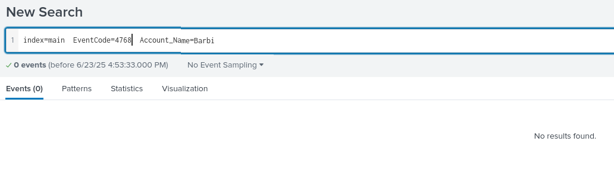

**Splunk es una plataforma de análisis de datos en tiempo real**, especialmente diseñada para recolectar, indexar, buscar, visualizar y analizar grandes volúmenes de datos generados por máquinas (logs, eventos, métricas, etc.).

## **¿Para qué se usa en ciberseguridad (SOC)?**

Splunk funciona como un **SIEM** (Security Information and Event Management), lo cual lo hace ideal para:

✅ **Monitorear eventos de seguridad**  
✅ **Detectar actividades sospechosas y amenazas**  
✅ **Correlacionar eventos entre distintos sistemas**  
✅ **Crear alertas personalizadas**  
✅ **Visualizar en dashboards ataques, incidentes y estadísticas de red**

### **¿Qué puede recolectar Splunk?**

- Logs de Windows (`eventvwr`)
- Logs de Linux (`/var/log/`)
- Tráfico de red (usando herramientas como Zeek o Suricata)
- Logs de firewall, IDS, antivirus, proxies
- Datos de servicios en la nube (AWS, Azure, GCP)
- Información de endpoints con Splunk Universal Forwarder

# Busquedas Comunes en Windows

### **Deteccion de BloodHound**

El recopilador BloodHound ejecuta númerosas consultas LDAP dirigidas al controlador de dominio, con el objetivo de acumular información sobre el dominio.
Windows puede sugerir usar el registro de supervision del rendimiento de LDAP `Event 1644`. Aun con ello puede que no se generen muchos de los eventos.

| 🧭 **Objetivo**                                            | 🔍 **Filtro LDAP / Tool**                          | 💡 **SPL en Splunk (equivalente)**                                         | 📝 **Notas / Eventos clave**                                                           |
| ---------------------------------------------------------- | -------------------------------------------------- | -------------------------------------------------------------------------- | -------------------------------------------------------------------------------------- |
| 🔑 Buscar usuarios con `pass` en descripción o comentarios | `(                                                 | (description=_pass_)(comment=_pass_))`**Metasploit**                       | `index=wineventlog (description="*pass*" OR comment="*pass*")`                         |
| 🖥️ Enumerar computadoras Windows Server                   | `(operatingSystem=*server*)`**Metasploit**         | `index=wineventlog operatingSystem="*Server*"`                             | Alternativo: buscar hosts con nombre `SRV` o eventos de logon tipo server.             |
| 👥 Enumerar grupos de AD                                   | `(objectClass=group)`**Metasploit**                | `index=wineventlog (EventCode=4731 OR EventCode=4732 OR EventCode=4733)`   | 4731 = Grupo creado4732 = Usuario agregado4733 = Usuario removido                      |
| 🧑‍💼 Grupos con `managedBy`                               | `(objectClass=group)(managedBy=*)`**Metasploit**   | No directo en Splunk sin integración LDAP.Alternativa: `EventCode=4728`    | Para ver cambios en grupos de seguridad (requiere logging de AD detallado).            |
| 🖧 Enumerar computadoras                                   | `sAMAccountType=805306369`**PowerView**            | `index=wineventlog EventCode=4624 Logon_Type=3``                           | stats count by host`                                                                   |
| 👤 Enumerar usuarios de dominio                            | `samAccountType=805306368`**PowerView**            | `index=wineventlog EventCode=4720 OR EventCode=4722 OR EventCode=4723`     | 4720 = Usuario creado4722 = Habilitado4723 = Cambio de password                        |
| 🎭 Buscar SPNs (Kerberoast)                                | `servicePrincipalName=*`**PowerView**              | `index=wineventlog EventCode=4769`                                         | TGS requested (Kerberos), clave para ataques de SPN                                    |
| 📂 Buscar DFS Shares                                       | `objectClass=msDFS-Linkv2`**PowerView**            | `index=* "DFS"`                                                            | Solo si hay eventos relacionados con DFS; también buscar acceso SMB (`EventCode=5140`) |
| 🗃️ Enumerar Organizational Units (OUs)                    | `(objectCategory=organizationalUnit)`**PowerView** | No directo sin integración con AD schema.Alternativa: ver `EventCode=5136` | 5136 = Cambios en objetos del directorio                                               |
| 🔍 Buscar usuarios con `samAccountType=805306368`          | `samAccountType=805306368`**Empire**               | `index=wineventlog EventCode=4720 OR EventCode=4722`                       | Eventos de usuario, útil para detectar cambios sospechosos                             |

**EventCodes más usados en Splunk para ataques AD**

| 🛠️ **Acción**                    | ⚙️ **EventCode** | 📌 **Descripción**      |
| --------------------------------- | ---------------- | ----------------------- |
| Inicio de sesión exitoso          | `4624`           | Revisión de logins      |
| Fallo de login                    | `4625`           | Intentos fallidos       |
| Creación de usuario               | `4720`           | Nuevo usuario           |
| Cambio de contraseña              | `4723`, `4724`   | Modificaciones de pass  |
| Creación de grupo                 | `4731`           | Nuevos grupos           |
| Usuario agregado a grupo          | `4728`, `4732`   | Privilegios modificados |
| Solicitud de TGS (SPN)            | `4769`           | Para Kerberoasting      |
| Acceso a recurso compartido (SMB) | `5140`           | DFS, C$ y otros shares  |

# Detección de rociado de contraseñas

Este es muy diferente a los ataques de fuerza bruta donde un atacante prueba numerosas contraseñas hacia una sola cuenta de usuario.
Un patrón que se asocia mucho es el intento fallido de inicio de sesión `Event ID 4625 - Failed Logon`.

Otros registros de eventos que pueden ayudar a la detección de robo de contraseñas:

- `4768 and ErrorCode 0x6 - Kerberos Invalid Users`
- `4768 and ErrorCode 0x12 - Kerberos Disabled Users`
- `4776 and ErrorCode 0xC000006A - NTLM Invalid Users`
- `4776 and ErrorCode 0xC0000064 - NTLM Wrong Password`
- `4648 - Authenticate Using Explicit Credentials`
- `4771 - Kerberos Pre-Authentication Failed`

### **Búsqueda de rociado de contraseñas con Splunk**

```bash
index=main earliest=1690280680 latest=1690289489 source="WinEventLog:Security" EventCode=4625
| bin span=15m _time
| stats values(user) as Users, dc(user) as dc_user by src, Source_Network_Address, dest, EventCode, Failure_Reason
```

*Nota: En caso de no encontrar nada se puede cambiar el rango de tiempo y modificar la búsqueda eliminando los filtros de tiempo earliest y latest.*

Un ejemplo de esto puede ser buscar un usuario de destino utilizando la busqueda anterior, hacemos una modificación y daremos con más resultados.

```bash
index=main source="WinEventLog:Security" EventCode=4625 
| search SQLSERVER.corp.local
| bin span=15m _time
| stats values(user) as Users, dc(user) as dc_user by src, Source_Network_Address, dest, EventCode, Failure_Reason
```


# Detección de ataques tipo respondedor

### **Intoxicación por LLMNR/NBT-NS/mDNS**

`LLMNR (Link-Local Multicast Name Resolution) and NBT-NS (NetBIOS Name Service) poisoning`, también conocidos como suplantación de NBNS, son ataques a nivel de red que aprovechan las ineficiencias de estos protocolos de resolución de nombres.

**Detección de ataques tipo respondedor con Splunk**

```shell
index=main earliest=1690290078 latest=1690291207 SourceName=LLMNRDetection
| table _time, ComputerName, SourceName, Message
```

El ID de evento 22 de Sysmon también se puede utilizar para rastrear consultas DNS asociadas con recursos compartidos de archivos inexistentes o mal escritos.

```shell
index=main earliest=1690290078 latest=1690291207 EventCode=22 
| table _time, Computer, user, Image, QueryName, QueryResults
```

Además, recuerde que Evento 4648 se puede utilizar para detectar inicios de sesión explícitos en recursos compartidos de archivos fraudulentos que los atacantes podrían usar para recopilar credenciales de usuario legítimas.

```shell
index=main earliest=1690290814 latest=1690291207 EventCode IN (4648) 
| table _time, EventCode, source, name, user, Target_Server_Name, Message
| sort 0 _time
```

Ejemplo: Modifique y utilice la búsqueda de Splunk basada en el Evento 22 de Sysmon en todos los datos ingresados ​​(de forma continua) para identificar todos los nombres de recursos compartidos cuya ubicación fue falsificada por 10.10.0.221. Ingrese el nombre del recurso compartido que falta de la siguiente lista como respuesta: myshare, myfileshar3, _

```shell
index=main EventCode IN (22) 
| search 10.10.0.221
| table _time, QueryResults, QueryName, src
```


# Detección de Kerberoasting/AS-REProasting

**KERBEROSTING**

Es una técnica dirigida a cuentas de servicio en entornos de Active Directory para extraer y descifrar sus hashes de contraseña. El ataque aprovecha el cifrado de los tickets de servicio de Kerberos y el uso de contraseñas débiles o fácilmente descifrables para las cuentas de servicio. Una vez que un atacante logra descifrar los hashes de contraseña, puede obtener acceso no autorizado a las cuentas de servicio objetivo y, potencialmente, moverse lateralmente dentro de la red.

#### Proceso de acceso a servicios benignos y eventos relacionados

Cuando un usuario se conecta a una `MSSQL (Microsoft SQL Server)`base de datos utilizando una cuenta de servicio con un `SPN`, se producen los siguientes pasos en el proceso de autenticación Kerberos:

- `TGT Request`: El usuario (cliente) inicia el proceso de autenticación solicitando un ticket de concesión de tickets (TGT) al Centro de distribución de claves (KDC), que normalmente forma parte del controlador de dominio de Active Directory.
- `TGT Issue`: El KDC verifica la identidad del usuario (generalmente mediante un hash de contraseña) y emite un TGT cifrado con su clave secreta. El TGT tiene una validez limitada y permite al usuario solicitar tickets de servicio sin necesidad de volver a autenticarse.
- `Service Ticket Request`: El cliente envía una solicitud de ticket de servicio (TGS-REQ) al KDC para el SPN del servidor MSSQL utilizando el TGT obtenido en el paso anterior.
- `Service Ticket Issue`: El KDC valida el TGT del cliente y, si la validación es correcta, emite un ticket de servicio (TGS) cifrado con la clave secreta de la cuenta de servicio, que contiene la identidad del cliente y una clave de sesión. El cliente recibe el TGS.
- `Client Connection`: El cliente se conecta al servidor MSSQL y envía el TGS al servidor como parte del proceso de autenticación.
- `MSSQL Server Validates the TGS`: El servidor MSSQL descifra el TGS con su propia clave secreta para obtener la clave de sesión y la identidad del cliente. Si el TGS es válido y la clave de sesión es correcta, el servidor MSSQL acepta la conexión del cliente y le otorga acceso a los recursos solicitados.

## Detección de Kerberoasting con Splunk

#### Solicitudes de TGS benignas

```shell
index=main earliest=1690388417 latest=1690388630 EventCode=4648 OR (EventCode=4769 AND service_name=iis_svc) 
| dedup RecordNumber 
| rex field=user "(?<username>[^@]+)"
| table _time, ComputerName, EventCode, name, username, Account_Name, Account_Domain, src_ip, service_name, Ticket_Options, Ticket_Encryption_Type, Target_Server_Name, Additional_Information
```

#### Detección de Kerberoasting - Consulta de SPN

```shell
index=main earliest=1690448444 latest=1690454437 source="WinEventLog:SilkService-Log" 
| spath input=Message 
| rename XmlEventData.* as * 
| table _time, ComputerName, ProcessName, DistinguishedName, SearchFilter 
| search SearchFilter="*(&(samAccountType=805306368)(servicePrincipalName=*)*"
```

#### Detección de Kerberoasting: solicitudes TGS

```shell
index=main earliest=1690450374 latest=1690450483 EventCode=4648 OR (EventCode=4769 AND service_name=iis_svc)
| dedup RecordNumber
| rex field=user "(?<username>[^@]+)"
| bin span=2m _time 
| search username!=*$ 
| stats values(EventCode) as Events, values(service_name) as service_name, values(Additional_Information) as Additional_Information, values(Target_Server_Name) as Target_Server_Name by _time, username
| where !match(Events,"4648")
```
#### Detección de Kerberoasting mediante transacciones - Solicitudes TGS

```shell
index=main earliest=1690450374 latest=1690450483 EventCode=4648 OR (EventCode=4769 AND service_name=iis_svc)
| dedup RecordNumber
| rex field=user "(?<username>[^@]+)"
| search username!=*$ 
| transaction username keepevicted=true maxspan=5s endswith=(EventCode=4648) startswith=(EventCode=4769) 
| where closed_txn=0 AND EventCode = 4769
| table _time, EventCode, service_name, username
```

# AS-REPRoasting

Es una técnica utilizada en entornos de Active Directory para atacar cuentas de usuario sin autenticación previa habilitada. En Kerberos, la autenticación previa es una función de seguridad que requiere que los usuarios comprueben su identidad antes de emitir el TGT. Sin embargo, ciertas cuentas de usuario, como aquellas con delegación sin restricciones, no tienen la autenticación previa habilitada, lo que las hace vulnerables a ataques de ASREPRoasting.

## Detección de AS-REPRoasting con Splunk

#### Detección de AS-REPRoasting: consulta de cuentas con autorización previa deshabilitada

```shell
index=main earliest=1690392745 latest=1690393283 source="WinEventLog:SilkService-Log" 
| spath input=Message 
| rename XmlEventData.* as * 
| table _time, ComputerName, ProcessName, DistinguishedName, SearchFilter 
| search SearchFilter="*(samAccountType=805306368)(userAccountControl:1.2.840.113556.1.4.803:=4194304)*"
```

#### Detección de AS-REPRoasting: solicitudes TGT para cuentas con autorización previa deshabilitada

```shell
index=main earliest=1690392745 latest=1690393283 source="WinEventLog:Security" EventCode=4768 Pre_Authentication_Type=0
| rex field=src_ip "(\:\:ffff\:)?(?<src_ip>[0-9\.]+)"
| table _time, src_ip, user, Pre_Authentication_Type, Ticket_Options, Ticket_Encryption_Type
```

Ejemplo: Modifique y utilice la búsqueda de Splunk proporcionada en la sección "Detección de Kerberoasting - Consultas SPN" de esta sección para todos los datos ingresados ​​(siempre). Ingrese el nombre del usuario que inició el proceso que ejecutó una consulta LDAP con la cadena "*(&(samAccountType=805306368)(servicePrincipalName=*)*" el 26/07/2023 a las 16:42:44 como respuesta. Formato de la respuesta: CORP\

Aunque esta me daba una información sobre el nombre del Filtro LDAP SPN con `samAccountName=iis_svc` no me daba la información de usuario que corrió el ejecutable. Lo que me llevó a buscar los multiples eventos 7136 en base a iis_svc.


```bash
index=*  
| search iis_svc source="XmlWinEventLog:Microsoft-Windows-Sysmon/Operational" 
| table _time, User, CommandLine, ProcessId
```


**Extra**

Esta consulta puede llegar a ser util para casos con una **correlación entre SilkService y Sysmon**

```bash
index=* source="XmlWinEventLog:Microsoft-Windows-Sysmon/Operational" 
| search CommandLine="*kerberoast*" OR CommandLine="*Rubeus*"
| table _time, User, host, CommandLine, ProcessId
```

# Detección de Pass-the-Hash

### Pass the hash

Es una técnica utilizada por atacantes para autenticarse en un sistema en red mediante el `NTLM`hash de la contraseña de un usuario en lugar de la contraseña en texto plano. El ataque aprovecha la forma en que Windows almacena los hashes de contraseñas en la memoria, lo que permite a los atacantes con acceso administrativo capturar el hash y reutilizarlo para el acceso lateral dentro de la red.

**Pasos del ataque**

- El atacante utiliza herramientas como `Mimikatz`la extracción del `NTLM`hash de un usuario conectado al sistema comprometido. Tenga en cuenta que se requieren privilegios de administrador local en el sistema para extraer el hash del usuario.
- Armado con el `NTLM`hash, el atacante puede autenticarse como el usuario objetivo en otros sistemas o recursos de red sin necesidad de conocer la contraseña real.
- Al utilizar la sesión autenticada, el atacante puede moverse lateralmente dentro de la red y obtener acceso no autorizado a otros sistemas y recursos.

#### Oportunidades de detección de Pass-the-Hash

Desde la perspectiva del Registro de eventos de Windows, se generan los siguientes registros cuando se ejecuta el comando **`runas`**:

- Cuando el comando `runas` se ejecuta sin la bandera `/netonly` - `Event ID 4624 (Logon)`con `LogonType 2 (interactive)`.
- Cuando `runas` se ejecuta un comando con la `/netonly`bandera - `Event ID 4624 (Logon)`con `LogonType 9 (NewCredentials)`.

#### Detección de Pass-the-Hash con Splunk

Antes de pasar a revisar las búsquedas, consulte [esta](https://blog.netwrix.com/2021/11/30/how-to-detect-pass-the-hash-attacks) fuente para comprender mejor de dónde se originó la parte de búsqueda `Logon_Process=seclogo`.
```shell
index=main earliest=1690450708 latest=1690451116 source="WinEventLog:Security" EventCode=4624 Logon_Type=9 Logon_Process=seclogo
| table _time, ComputerName, EventCode, user, Network_Account_Domain, Network_Account_Name, Logon_Type, Logon_Process
```

podemos mejorar la búsqueda anterior agregando acceso a memoria LSASS a la mezcla de la siguiente manera.
```shell
index=main earliest=1690450689 latest=1690451116 (source="XmlWinEventLog:Microsoft-Windows-Sysmon/Operational" EventCode=10 TargetImage="C:\\Windows\\system32\\lsass.exe" SourceImage!="C:\\ProgramData\\Microsoft\\Windows Defender\\platform\\*\\MsMpEng.exe") OR (source="WinEventLog:Security" EventCode=4624 Logon_Type=9 Logon_Process=seclogo)
| sort _time, RecordNumber
| transaction host maxspan=1m endswith=(EventCode=4624) startswith=(EventCode=10)
| stats count by _time, Computer, SourceImage, SourceProcessId, Network_Account_Domain, Network_Account_Name, Logon_Type, Logon_Process
| fields - count
```

*Ejemplo: Se produjo un ataque Pass-the-Hash durante el siguiente intervalo de tiempo: earliest=1690543380 latest=1690545180. Ingrese el nombre del equipo involucrado como respuesta.*


# Detectando Pass-the-Ticket

## Pass the Ticket (PtT)

Es una técnica de movimiento lateral utilizada por atacantes para desplazarse lateralmente dentro de una red mediante el uso indebido de los tickets TGT (Ticket Granting Ticket) y TGS (Ticket Granting Service) de Kerberos. En lugar de usar hashes NTLM, PtT aprovecha los tickets Kerberos para autenticarse en otros sistemas y acceder a los recursos de la red sin necesidad de conocer las contraseñas de los usuarios. Esta técnica permite a los atacantes desplazarse lateralmente y obtener acceso no autorizado a múltiples sistemas.

**Pasos de ataque:**

- El atacante obtiene acceso administrativo a un sistema, ya sea a través de un compromiso inicial o una escalada de privilegios.
- El atacante utiliza herramientas como `Mimikatz`o `Rubeus`para extraer tickets TGT o TGS válidos de la memoria del sistema comprometido.
- El atacante envía el ticket extraído para la sesión actual. Ahora puede autenticarse en otros sistemas y recursos de red sin necesidad de contraseñas en texto plano.

#### Eventos de seguridad de Windows relacionados

Durante el acceso del usuario a los recursos de red, se generan varios registros de eventos de Windows para registrar el proceso de inicio de sesión y las actividades relacionadas.

- `Event ID 4648 (Explicit Credential Logon Attempt)`:Este evento se registra cuando se proporcionan credenciales explícitas (por ejemplo, nombre de usuario y contraseña) durante el inicio de sesión.
- `Event ID 4624 (Logon)`:Este evento indica que un usuario ha iniciado sesión correctamente en el sistema.
- `Event ID 4672 (Special Logon)`:Este evento se registra cuando el inicio de sesión de un usuario incluye privilegios especiales, como ejecutar aplicaciones como administrador.
- `Event ID 4768 (Kerberos TGT Request)`:Este evento se registra cuando un cliente solicita un ticket de concesión de tickets (TGT) durante el proceso de autenticación Kerberos.
- `Event ID 4769 (Kerberos Service Ticket Request)`:Cuando un cliente solicita un ticket de servicio (ticket TGS) para acceder a un servicio remoto durante el proceso de autenticación Kerberos, se genera el ID de evento 4769.

## Detección de fraudes con Splunk

Ahora exploraremos cómo podemos identificar Pass-the-Ticket, usando Splunk.

```shell
index=main earliest=1690392405 latest=1690451745 source="WinEventLog:Security" user!=*$ EventCode IN (4768,4769,4770) 
| rex field=user "(?<username>[^@]+)"
| rex field=src_ip "(\:\:ffff\:)?(?<src_ip_4>[0-9\.]+)"
| transaction username, src_ip_4 maxspan=10h keepevicted=true startswith=(EventCode=4768)
| where closed_txn=0
| search NOT user="*$@*"
| table _time, ComputerName, username, src_ip_4, service_name, category
```

*Ejemplo: Ejecute la búsqueda de Splunk que se proporciona al final de esta sección para encontrar todos los nombres de usuario que podrían haber ejecutado un ataque de paso de tickets. Ingrese el nombre de usuario que falta de la siguiente lista como respuesta. Administrador, _*


## Detectando Sobrepaso de Hash

### Overpass-the-Hash

Los adversarios pueden utilizar esta `Overpass-the-Hash`técnica para obtener TGT de Kerberos aprovechando hashes de contraseñas robadas para moverse lateralmente dentro de un entorno o para eludir los controles de acceso habituales del sistema. Overpass-the-Hash (también conocido como [`Pass-the-Key`]) permite la autenticación mediante Kerberos en lugar de NTLM. Tanto los hashes NTLM como las claves AES pueden servir como base para solicitar un TGT de Kerberos.

#### Pasos de ataque:

- El atacante utiliza herramientas como Mimikatz para extraer el hash NTLM de un usuario que haya iniciado sesión en el sistema comprometido. El atacante debe tener al menos privilegios de administrador local en el sistema para poder extraer el hash del usuario.
- El atacante utiliza una herramienta como Rubeus para crear una solicitud AS-REQ sin procesar para que un usuario específico solicite un ticket TGT. Este paso no requiere privilegios elevados en el host para solicitar el TGT, lo que lo convierte en un enfoque más sigiloso que el ataque Pass-the-Hash de Mimikatz.
- De manera análoga a la técnica Pass-the-Ticket, el atacante envía el ticket solicitado para la sesión de inicio de sesión actual.

#### Oportunidades de detección de sobrepaso del hash

`Mimikatz`El ataque Overpass-the-Hash deja los mismos artefactos que el ataque Pass-the-Hash y se puede detectar utilizando las mismas estrategias.

`Rubeus`Sin embargo, presenta un escenario ligeramente diferente. A menos que el TGT solicitado se utilice en otro host, los mecanismos de detección de Pass-the-Ticket podrían no ser efectivos, ya que Rubeus envía una solicitud AS-REQ directamente al controlador de dominio (DC), generando [`Event ID 4768 (Kerberos TGT Request)`]. No obstante, la comunicación con el DC ( `TCP/UDP port 88`) desde un proceso inusual puede indicar un posible ataque Overpass-the-Hash.

## Detección de errores hash con Splunk (objetivo: Rubeus)

```shell
index=main earliest=1690443407 latest=1690443544 source="XmlWinEventLog:Microsoft-Windows-Sysmon/Operational" (EventCode=3 dest_port=88 Image!=*lsass.exe) OR EventCode=1
| eventstats values(process) as process by process_id
| where EventCode=3
| stats count by _time, Computer, dest_ip, dest_port, Image, process
| fields - count
```

*Ejemplo: Utilice la búsqueda de Splunk que se proporciona al final de esta sección en todos los datos ingresados ​​(Todo el tiempo) para encontrar todas las imágenes involucradas (campo Imagen). Ingrese el nombre de la imagen que falta de la siguiente lista como respuesta. Rubeus.exe, _.exe*


# Detectando Golden Tickets/Silver Tickets

## Golden Ticket

Un `Golden Ticket`ataque es un método potente en el que un atacante falsifica un ticket de concesión de tickets (TGT) para obtener acceso no autorizado a un dominio de Windows Active Directory como administrador. El atacante crea un TGT con credenciales de usuario arbitrarias y utiliza este ticket falsificado para hacerse pasar por un administrador, obteniendo así el control total del dominio. El ataque Golden Ticket es sigiloso y persistente, ya que el ticket falsificado tiene una larga validez y permanece válido hasta su vencimiento o revocación.

### Pasos de ataques: 

- El atacante extrae el hash NTLM de la cuenta KRBTGT mediante un `DCSync`ataque (alternativamente, puede usar `NTDS.dit`y `LSASS process dumps`en el controlador de dominio).
- Armado con el `KRBTGT`hash, el atacante falsifica un TGT para una cuenta de usuario arbitraria, asignándole privilegios de administrador de dominio.
- - El atacante inyecta el TGT falsificado de la misma manera que en un ataque Pass-the-Ticket.

#### Oportunidades de detección de boletos dorados

Detectar ataques de Golden Ticket puede ser complicado, ya que un atacante puede falsificar el TGT sin conexión, sin dejar prácticamente rastros de `Mimikatz`ejecución. Una opción es monitorear los métodos comunes de extracción del `KRBTGT`hash:

- `DCSync attack`
- `NTDS.dit file access`
- `LSASS memory read on the domain controller (Sysmon Event ID 10)`

Desde otro punto de vista, un Boleto Dorado es simplemente otro boleto para la detección de Pass-the-Ticket.

## Detección de tickets dorados con Splunk (otro método para pasar tickets)

```shell
index=main earliest=1690451977 latest=1690452262 source="WinEventLog:Security" user!=*$ EventCode IN (4768,4769,4770) 
| rex field=user "(?<username>[^@]+)"
| rex field=src_ip "(\:\:ffff\:)?(?<src_ip_4>[0-9\.]+)"
| transaction username, src_ip_4 maxspan=10h keepevicted=true startswith=(EventCode=4768)
| where closed_txn=0
| search NOT user="*$@*"
| table _time, ComputerName, username, src_ip_4, service_name, category
```

# Silver Ticket

Los adversarios que poseen el hash de la contraseña de una cuenta de servicio objetivo (p. ej., `SharePoint`, `MSSQL`) pueden falsificar tickets del Servicio de Concesión de Tickets (TGS) de Kerberos, también conocidos como `Silver Tickets`. Los tickets Silver pueden usarse para suplantar la identidad de cualquier usuario, pero su alcance es más limitado que el de los Golden Tickets, ya que solo permiten a los adversarios acceder a un recurso específico (p. ej., `MSSQL`) y al sistema que lo aloja.

### Pasos de ataque: 

- El atacante extrae el hash NTLM de la cuenta de servicio de destino (o la cuenta de computadora para `CIFS`el acceso) utilizando herramientas como `Mimikatz`u otras técnicas de volcado de credenciales.
- Generar un ticket plateado: utilizando el hash NTLM extraído, el atacante emplea herramientas como `Mimikatz`para crear un ticket TGS falsificado para el servicio especificado.
- El atacante inyecta el TGT falsificado de la misma manera que en un ataque Pass-the-Ticket.

#### Oportunidades de detección de boletos plateados

Detectar tickets de servicio falsificados (TGS) puede ser complicado, ya que no existen indicadores sencillos de ataque. Tanto en los ataques de Ticket Dorado como de Ticket Plateado, se pueden usar usuarios arbitrarios. `including non-existent ones`. `Event ID 4720 (A user account was created)`puede ayudar a identificar usuarios recién creados. Posteriormente, podemos comparar esta lista de usuarios con los usuarios conectados.

Debido a que no existe validación para los permisos de usuario, a los usuarios se les pueden otorgar permisos administrativos. `Event ID 4672 (Special Logon)`se puede emplear para detectar privilegios asignados de forma anómala.

## Detección de billetes de plata con Splunk

#### Detección de tickets de plata con Splunk mediante correlación de usuarios

Primero, creemos una lista de usuarios ( `users.csv`) aprovechando `Event ID 4720 (A user account was created)`lo siguiente.

```shell
index=main latest=1690448444 EventCode=4720
| stats min(_time) as _time, values(EventCode) as EventCode by user
| outputlookup users.csv
```
**Nota** : `users.csv`se puede descargar desde la `Resources`sección de este módulo (esquina superior derecha) y cargar en Splunk haciendo clic en `Settings`-> `Lookups`-> `Lookup table files`-> `New Lookup Table File`.

```shell
index=main latest=1690545656 EventCode=4624
| stats min(_time) as firstTime, values(ComputerName) as ComputerName, values(EventCode) as EventCode by user
| eval last24h = 1690451977
| where firstTime > last24h
```| eval last24h=relative_time(now(),"-24h@h")```
| convert ctime(firstTime)
| convert ctime(last24h)
| lookup users.csv user as user OUTPUT EventCode as Events
| where isnull(Events)
```
#### Detección de tickets Silver con Splunk mediante privilegios especiales asignados a nuevos inicios de sesión

```shell-session
index=main latest=1690545656 EventCode=4672
| stats min(_time) as firstTime, values(ComputerName) as ComputerName by Account_Name
| eval last24h = 1690451977 
```| eval last24h=relative_time(now(),"-24h@h") ```
| where firstTime > last24h 
| table firstTime, ComputerName, Account_Name 
| convert ctime(firstTime)
```
*Ejemplo: ¿Para qué "servicio" el usuario llamado Barbi generó un ticket plata?*

- ### Puedes **sospechar fuertemente** de uso de Mimikatz o Rubeus cuando:

1. Usuario inesperado recibe privilegios (`4672`)
    
2. No hay TGT ni TGS request (`4768` / `4769`)
    
3. Hay logon por Kerberos con `KeyLength=0` (`4624`)
    
4. Destino del logon: `CIFS/<host>` (o actividad SMB posterior)





# Detección de ataques de delegación sin restricciones/delegación restringida

## Delegación sin restricciones

Es un privilegio que se puede otorgar a cuentas de usuario o de equipo en un entorno de Active Directory, lo que permite que un servicio se autentique en otro recurso en nombre del `any`usuario. Esto puede ser necesario cuando, por ejemplo, un servidor web requiere acceso a un servidor de bases de datos para realizar cambios en nombre de un usuario.

- Pasos para el ataque:
1. El atacante identifica los sistemas en los que está habilitada la delegación sin restricciones para las cuentas de servicio.
2. El atacante obtiene acceso a un sistema con la delegación sin restricciones habilitada.
3. El atacante extrae tickets TGT (Ticket Granting Ticket) de la memoria del sistema comprometido utilizando herramientas como `Mimikatz`

#### Oportunidades de detección de ataques de delegación sin restricciones

Los comandos de PowerShell y los filtros de búsqueda LDAP utilizados para la detección de delegación sin restricciones se pueden detectar mediante la supervisión del registro de bloques de scripts de PowerShell ( `Event ID 4104`) y el registro de solicitudes LDAP.

El objetivo principal de un ataque de delegación sin restricciones es recuperar y reutilizar los tickets TGT, por lo que también se puede utilizar la detección de paso de ticket.

## Detección de ataques de delegación sin restricciones con Splunk

```shell
index=main earliest=1690544538 latest=1690544540 source="WinEventLog:Microsoft-Windows-PowerShell/Operational" EventCode=4104 Message="*TrustedForDelegation*" OR Message="*userAccountControl:1.2.840.113556.1.4.803:=524288*" 
| table _time, ComputerName, EventCode, Message
```

## Delegación restringida

Es una característica de **Active Directory** que permite a ciertos servicios actuar _en nombre de un usuario_, pero **solo frente a servicios específicos** y previamente autorizados.

Imagina que un servidor (por ejemplo, un servidor web) necesita acceder a otro servicio (como una base de datos) usando las credenciales del usuario que inició sesión. Con la delegación restringida, se le puede dar permiso **solo para acceder a esa base de datos y no a otros servicios**. Esto es una medida de seguridad importante, porque evita que un servicio pueda usar las credenciales del usuario para acceder a cualquier parte de la red.

Esto funciona gracias a una propiedad llamada `msDS-AllowedToDelegateTo`. Esta propiedad le dice al servidor:  
🗣️ _"Solo puedes hacerte pasar por usuarios para estos servicios específicos que están en esta lista."_

- Pasos de ataque:
1. El atacante identifica los sistemas donde está habilitada la delegación restringida y determina los recursos a los que se les permite delegar.
2. El atacante obtiene acceso al TGT del principal (usuario o equipo). El TGT puede extraerse de la memoria (volcado de Rubeus) o solicitarse con el hash del principal.
3. El atacante utiliza la técnica S4U para suplantar una cuenta con altos privilegios en el servicio objetivo (solicitando un ticket TGS).
4. El atacante inyecta el ticket solicitado y accede a los servicios específicos como el usuario suplantado.
