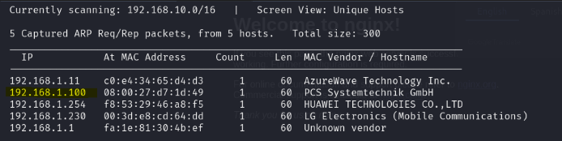
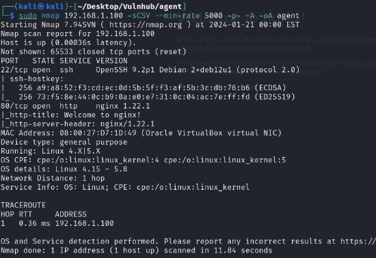
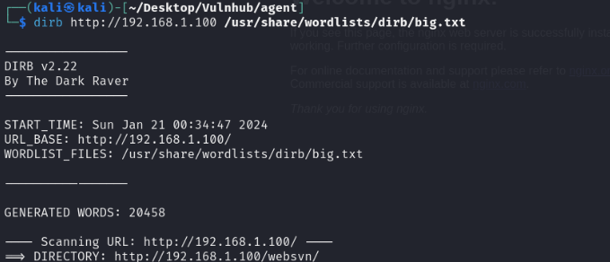
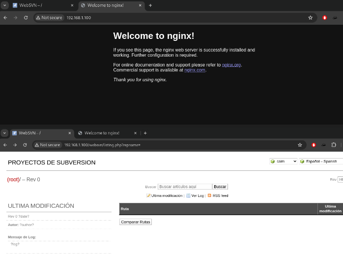
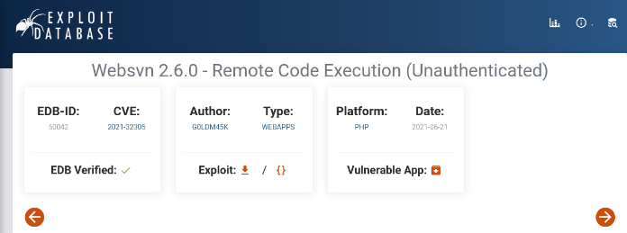
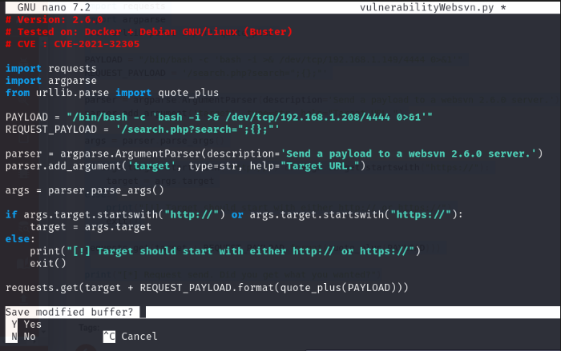
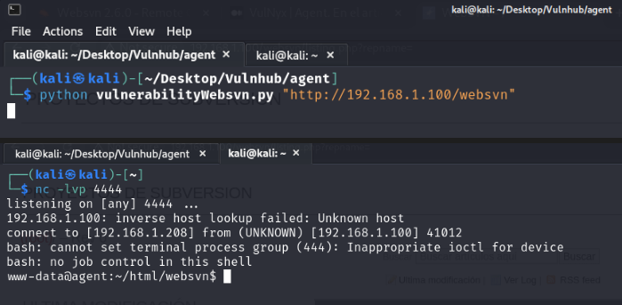
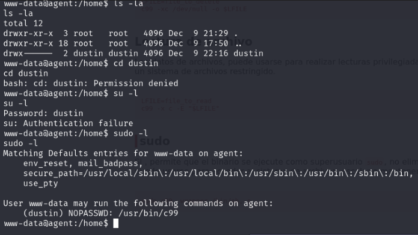
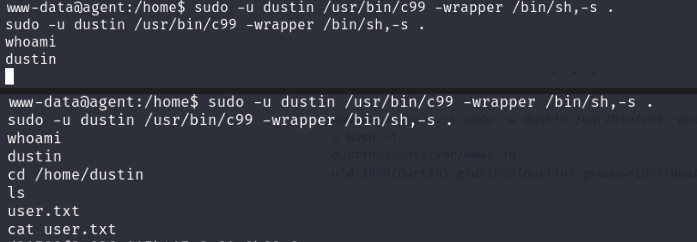
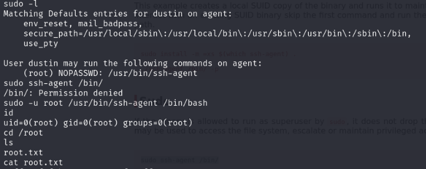

## *RECONOCIMIENTO*
Como en todas las maquinas a realizar comenzamos con un escaneo de red para encontrar nuestra maquina a atacar, con el comando netdiscover buscaré la IP y comenzar a buscar información relevante de la maquina

Ya encontrada la IP a auditar comenzaré con un escaneo de puertos en nmap para determinar que puertos pueden llegar a ser útiles dentro del ataque

Veo que hay dos servicios en ejecución, los cuales son el puerto 22 y 80, así que voy a hacer una enumeración de directorio con el comando dirb y gobuster para buscar más rutas dentro de la pagina web y que me puedan dar más información.

## *Análisis de vulnerabilidades*
Dentro de la pagina encontré el servidor con su versión y busque información sobre alguna vulnerabilidad en Exploit Database y pude hallar la misma versión

## *Explotación*

Editamos el archivo para ajustarlo a nuestra red y nos ponemos en puerto de escucha para poder hacer la conexión al sistema.

Ya teniendo acceso al sistema pues lo siguiente seria buscar las flag tanto de el usuario como el root, aunque puede darse que elevar privilegios no sea tan facil
Encuentro un usuario pero por lo visto tengo denegado el permiso y acceder a este, busco de que otra manera puedo obtener mejores permisos y veo que puedo correr un comando con c99 e investigo para saber de que se trata

Ya digitado el comando tenemos el acceso a dustin y con ello la primer flag

## *Post-Explotación*
Para finalizar volvemos a buscar la manera de ingresar a root, nos muestra una ruta y lo que hacemos es terminar de editar la informacion para poder escalar privilegios, conseguimos el acceso y buscamos la flag para dar por culminada la maquina

